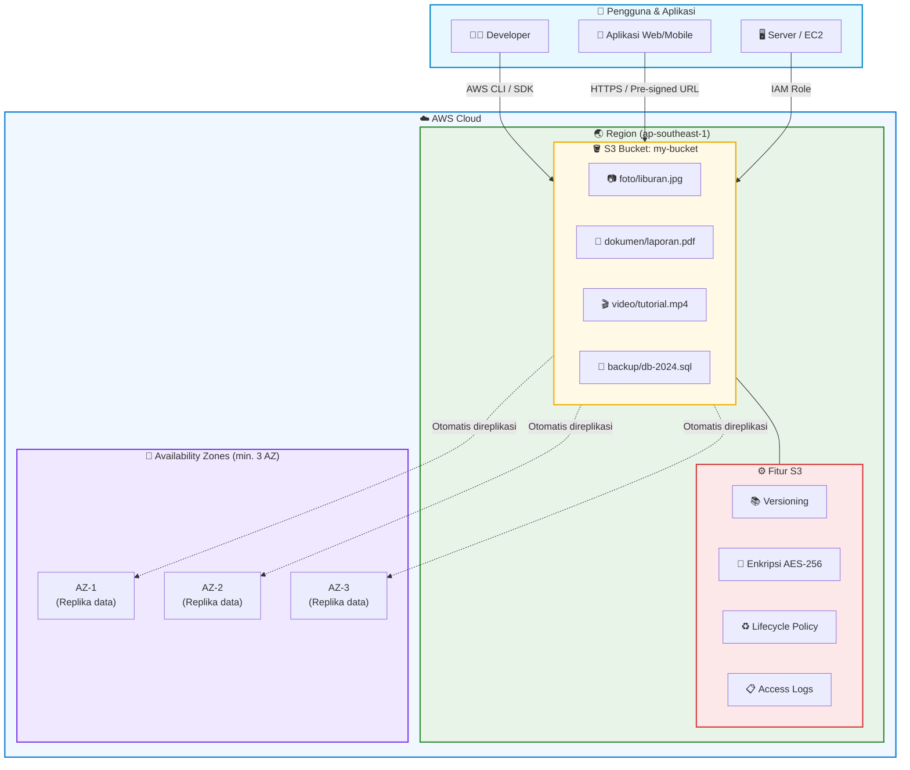
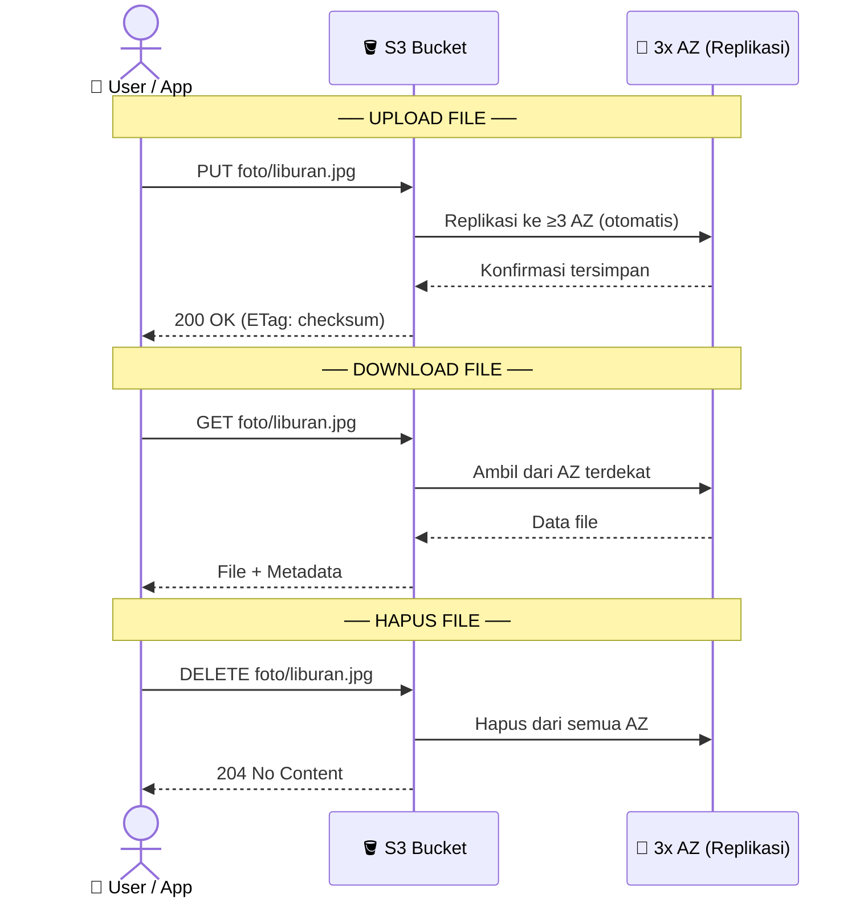
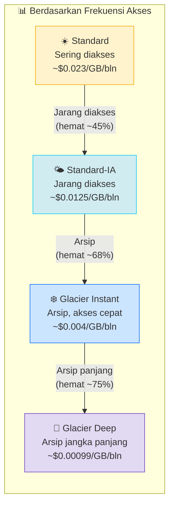
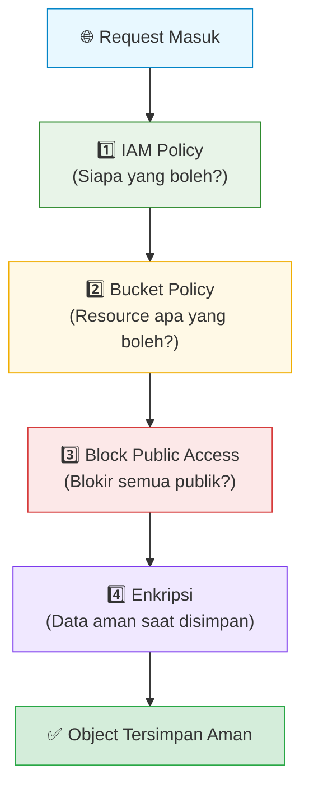
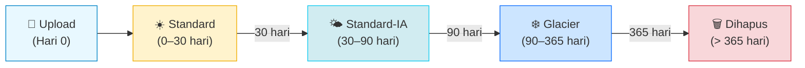

# ☁️ Panduan AWS S3 — Simple Storage Service

> Penyimpanan objek yang tak terbatas, aman, dan murah di cloud AWS.

---

## 🤔 Apa itu AWS S3?

**Amazon S3 (Simple Storage Service)** adalah layanan penyimpanan objek di cloud. Bayangkan S3 seperti **hard disk raksasa di internet** — kamu bisa menyimpan file apa saja (gambar, video, dokumen, backup, kode), kapan saja, dari mana saja.

### Analogi Sederhana

```
Hard Disk Biasa       ←→     AWS S3
─────────────────────────────────────
Folder                ←→     Bucket
File                  ←→     Object
Path (C:/foto/a.jpg)  ←→     Key (s3://bucket/foto/a.jpg)
Kapasitas terbatas    ←→     Tidak terbatas (pratisnya unlimited)
Hanya di 1 lokasi     ←→     Tersebar di banyak data center
```

---

## 🏗️ Konsep Utama S3

### 1. Bucket
Wadah utama tempat semua file disimpan. Setiap bucket:
- Namanya **unik secara global** di seluruh AWS
- Berada di **satu Region** tertentu
- Bisa menyimpan objek **tak terbatas**

### 2. Object (File)
Setiap file yang disimpan di S3 disebut **object**, terdiri dari:
- **Key** — nama/path file (misal: `foto/2024/liburan.jpg`)
- **Value** — isi datanya (bytes)
- **Metadata** — info tambahan (ukuran, tipe, tanggal)
- **Version ID** — jika versioning aktif

### 3. Key (Path File)
S3 tidak punya folder sungguhan — semua flat. Tapi dengan karakter `/` pada key, terlihat seperti folder:

```
bucket-saya/
├── foto/
│   ├── liburan.jpg       → key: "foto/liburan.jpg"
│   └── ulang-tahun.png   → key: "foto/ulang-tahun.png"
├── dokumen/
│   └── laporan.pdf       → key: "dokumen/laporan.pdf"
└── backup.zip            → key: "backup.zip"
```

---

## 📐 Diagram Arsitektur S3

### Gambaran Umum



### Cara Kerja Upload & Download



---

## 🗂️ Storage Class — Pilih Sesuai Kebutuhan

S3 punya beberapa "kelas" penyimpanan dengan harga dan performa berbeda:



| Storage Class | Kapan Digunakan | Akses | Biaya/GB |
|---------------|-----------------|-------|----------|
| **Standard** | Website, app aktif | Instan | ~$0.023 |
| **Standard-IA** | Backup, DR | Instan | ~$0.0125 |
| **One Zone-IA** | Data bisa direkrasi ulang | Instan, 1 AZ | ~$0.01 |
| **Glacier Instant** | Arsip yang kadang perlu | Milidetik | ~$0.004 |
| **Glacier Flexible** | Arsip jangka panjang | 1–12 jam | ~$0.0036 |
| **Glacier Deep Archive** | Arsip > 7 tahun | 12–48 jam | ~$0.00099 |

> 💡 **Tips:** Gunakan **Intelligent-Tiering** jika pola akses tidak pasti — S3 otomatis pindahkan objek ke kelas lebih murah saat tidak diakses.

---

## 🔐 Keamanan S3

### Lapisan Keamanan



### Jenis Kontrol Akses

**1. IAM Policy** — Siapa yang bisa mengakses
```json
{
  "Effect": "Allow",
  "Action": ["s3:GetObject", "s3:PutObject"],
  "Resource": "arn:aws:s3:::my-bucket/*"
}
```

**2. Bucket Policy** — Aturan di level bucket
```json
{
  "Effect": "Deny",
  "Principal": "*",
  "Action": "s3:*",
  "Condition": {
    "Bool": { "aws:SecureTransport": "false" }
  }
}
```

**3. Pre-signed URL** — Akses sementara tanpa login AWS
```bash
# Buat URL yang valid selama 1 jam
aws s3 presign s3://my-bucket/foto/liburan.jpg --expires-in 3600
# → https://my-bucket.s3.amazonaws.com/foto/liburan.jpg?X-Amz-Expires=3600&...
```

---

## 🔄 Fitur Penting S3

### Versioning

Simpan semua versi file — tidak ada yang hilang permanen:

```
laporan.pdf  →  Versi 1 (v1)
laporan.pdf  →  Versi 2 (v2)  ← versi terbaru
laporan.pdf  →  Versi 3 (v3)  ← aktif
                   ↑ bisa restore ke versi manapun
```

### Lifecycle Policy

Otomatis pindahkan atau hapus objek berdasarkan umur:



### Static Website Hosting

S3 bisa menjadi hosting website statis (HTML/CSS/JS) — tanpa server!

```
Browser → s3-website.amazonaws.com/index.html → S3 Bucket → File HTML
```

Aktifkan di: Bucket → Properties → Static website hosting → Enable

---

## 💻 Cara Menggunakan S3

### Via AWS Console (Web)
1. Buka [console.aws.amazon.com/s3](https://console.aws.amazon.com/s3)
2. Klik **Create bucket** → isi nama → pilih region → Create
3. Klik bucket → **Upload** → drag & drop file

### Via AWS CLI

```bash
# Buat bucket
aws s3 mb s3://nama-bucket-saya

# Upload file
aws s3 cp file.jpg s3://nama-bucket-saya/

# Upload seluruh folder
aws s3 sync ./folder-lokal/ s3://nama-bucket-saya/folder/

# Download file
aws s3 cp s3://nama-bucket-saya/file.jpg ./

# List isi bucket
aws s3 ls s3://nama-bucket-saya/

# Hapus file
aws s3 rm s3://nama-bucket-saya/file.jpg

# Hapus bucket beserta isinya
aws s3 rb s3://nama-bucket-saya --force
```

### Via Python (Boto3)

```python
import boto3

s3 = boto3.client('s3')

# Upload file
s3.upload_file('foto.jpg', 'nama-bucket', 'foto/foto.jpg')

# Download file
s3.download_file('nama-bucket', 'foto/foto.jpg', 'foto-lokal.jpg')

# List objects
response = s3.list_objects_v2(Bucket='nama-bucket')
for obj in response['Contents']:
    print(obj['Key'], obj['Size'])

# Generate pre-signed URL (valid 1 jam)
url = s3.generate_presigned_url(
    'get_object',
    Params={'Bucket': 'nama-bucket', 'Key': 'foto/foto.jpg'},
    ExpiresIn=3600
)
print(url)
```

---

## 🎯 Use Case Populer

| Use Case | Penjelasan |
|----------|-----------|
| **Backup & Restore** | Backup database, file sistem, snapshot |
| **Static Website** | Host HTML/CSS/JS tanpa server |
| **Media Storage** | Simpan gambar, video, audio aplikasi |
| **Data Lake** | Simpan data mentah untuk analitik (Athena, Redshift) |
| **Log Storage** | Simpan log aplikasi, CloudTrail, ALB logs |
| **Distribusi Konten** | Pasangkan dengan CloudFront CDN |
| **Disaster Recovery** | Replikasi lintas region (Cross-Region Replication) |
| **Big Data** | Input/output untuk EMR, Glue, Spark |

---

## 💰 Estimasi Biaya (Region ap-southeast-1)

| Komponen | Harga |
|----------|-------|
| Storage Standard | ~$0.025/GB/bulan |
| GET Request | ~$0.00043 per 1.000 request |
| PUT Request | ~$0.0054 per 1.000 request |
| Data Transfer keluar | ~$0.09/GB (setelah 1 GB/bln gratis) |
| Data Transfer masuk | **Gratis** |

**Contoh kalkulasi — 100 GB data, 10.000 request/hari:**
```
Storage  : 100 GB × $0.025         =  $2.50/bln
GET      : 300.000 × $0.00000043   =  $0.13/bln
PUT      : 10.000  × $0.0000054    =  $0.05/bln
Transfer : 10 GB   × $0.09         =  $0.90/bln
─────────────────────────────────────────────
Total                              ~  $3.58/bln
```

> ✅ **Free Tier (12 bulan pertama):** 5 GB storage, 20.000 GET, 2.000 PUT, 15 GB transfer keluar.

---

## ⚡ Tips & Best Practices

### ✅ Lakukan
- Aktifkan **Block Public Access** di semua bucket (kecuali memang perlu publik)
- Aktifkan **enkripsi** (SSE-S3 gratis, SSE-KMS untuk kontrol lebih)
- Pakai **Lifecycle Policy** untuk hemat biaya
- Gunakan **Versioning** untuk data penting
- Aktifkan **Access Logging** untuk audit
- Beri nama bucket yang **deskriptif**: `perusahaan-proyek-env-region`

### ❌ Hindari
- Jangan simpan **credential atau secret** di S3 (gunakan Secrets Manager)
- Jangan buat bucket **public** kecuali untuk static website
- Jangan gunakan S3 Standard untuk data yang **jarang diakses** (boros biaya)
- Jangan lupa aktifkan **MFA Delete** untuk bucket kritikal

---

## 📖 Ringkasan

```
S3 = Tempat simpan file di cloud (object storage)
     ├── Bucket  = "folder utama" (unik global)
     ├── Object  = file yang disimpan
     └── Key     = nama/path file

Keunggulan:
  ✅ Kapasitas tidak terbatas
  ✅ Durabilitas 99.999999999% (11 sembilan)
  ✅ Tersedia di banyak region
  ✅ Terintegrasi dengan semua layanan AWS
  ✅ Harga sangat terjangkau

Keamanan:
  🔐 IAM Policy + Bucket Policy + Block Public Access + Enkripsi
```

---

*Dokumentasi resmi: [docs.aws.amazon.com/s3](https://docs.aws.amazon.com/s3/index.html)*
