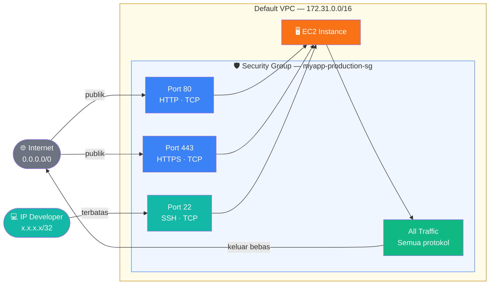

# Dokumentasi — AWS Security Group dengan Terraform

## Gambaran Umum

Kode ini membuat **AWS Security Group** secara deklaratif menggunakan Terraform dalam **1 file tunggal** tanpa variabel terpisah. Security Group berfungsi sebagai firewall virtual yang mengontrol trafik masuk (inbound) dan keluar (outbound) dari EC2 instance.

VPC ID diambil otomatis dari **Default VPC** menggunakan data source `aws_vpc` — tidak perlu hardcode ID secara manual.

---

## Diagram Alur Trafik



---

## Isi File `security-group-simple.tf`

```hcl
terraform {
  required_version = ">= 1.5.0"

  required_providers {
    aws = {
      source  = "hashicorp/aws"
      version = "~> 5.0"
    }
  }
}

provider "aws" {
  region = "ap-southeast-1"
}

# Ambil Default VPC otomatis — tanpa perlu hardcode ID
data "aws_vpc" "default" {
  default = true
}

resource "aws_security_group" "main" {
  name        = "myapp-production-sg"
  description = "Security group untuk EC2 myapp"
  vpc_id      = data.aws_vpc.default.id  # Gunakan Default VPC otomatis

  tags = {
    Name        = "myapp-production-sg"
    Environment = "production"
    ManagedBy   = "terraform"
  }
}

resource "aws_vpc_security_group_ingress_rule" "http" {
  security_group_id = aws_security_group.main.id
  description       = "HTTP dari internet"
  cidr_ipv4         = "0.0.0.0/0"
  from_port         = 80
  to_port           = 80
  ip_protocol       = "tcp"
}

resource "aws_vpc_security_group_ingress_rule" "https" {
  security_group_id = aws_security_group.main.id
  description       = "HTTPS dari internet"
  cidr_ipv4         = "0.0.0.0/0"
  from_port         = 443
  to_port           = 443
  ip_protocol       = "tcp"
}

resource "aws_vpc_security_group_ingress_rule" "ssh" {
  security_group_id = aws_security_group.main.id
  description       = "SSH dari IP developer"
  cidr_ipv4         = "103.10.20.30/32"  # Ganti dengan IP publik kamu
  from_port         = 22
  to_port           = 22
  ip_protocol       = "tcp"
}

resource "aws_vpc_security_group_egress_rule" "all_outbound" {
  security_group_id = aws_security_group.main.id
  description       = "Izinkan semua trafik keluar"
  cidr_ipv4         = "0.0.0.0/0"
  ip_protocol       = "-1"
}

output "security_group_id" {
  value       = aws_security_group.main.id
  description = "ID Security Group — gunakan ini saat membuat EC2"
}

output "vpc_id" {
  value       = data.aws_vpc.default.id
  description = "ID Default VPC yang digunakan"
}
```

---

## Penjelasan Per Blok

### 1. Blok `terraform {}` — Konfigurasi Awal

```hcl
terraform {
  required_version = ">= 1.5.0"
  required_providers {
    aws = {
      source  = "hashicorp/aws"
      version = "~> 5.0"
    }
  }
}
```

Mendefinisikan versi minimum Terraform dan provider AWS yang digunakan. Tanda `~> 5.0` berarti Terraform akan menggunakan versi 5.x manapun tapi tidak lompat ke versi 6.x.

---

### 2. Blok `provider "aws"` — Koneksi ke AWS

```hcl
provider "aws" {
  region = "ap-southeast-1"
}
```

Menentukan region AWS tempat semua resource dibuat. Region `ap-southeast-1` adalah Singapore — terdekat dari Indonesia.

---

### 3. Data Source `aws_vpc` — Ambil Default VPC ⭐ Baru

```hcl
data "aws_vpc" "default" {
  default = true
}
```

Data source berbeda dari resource — ia **membaca** infrastruktur yang sudah ada di AWS, bukan membuatnya. Dengan `default = true`, Terraform otomatis mencari dan menggunakan Default VPC di region yang aktif tanpa perlu hardcode ID apapun.

| | Resource | Data Source |
|--|----------|-------------|
| **Fungsi** | Membuat infrastruktur baru | Membaca infrastruktur yang sudah ada |
| **Contoh** | `resource "aws_security_group"` | `data "aws_vpc"` |
| **Di state?** | Ya | Tidak |

ID-nya kemudian digunakan di resource security group via `data.aws_vpc.default.id`.

---

### 4. Resource `aws_security_group` — Membuat Security Group

```hcl
resource "aws_security_group" "main" {
  name        = "myapp-production-sg"
  description = "Security group untuk EC2 myapp"
  vpc_id      = data.aws_vpc.default.id  # ← dari data source
  ...
}
```

Membuat Security Group kosong di dalam Default VPC. Rules ditambahkan secara terpisah di resource berikutnya.

| Atribut | Nilai | Keterangan |
|---------|-------|------------|
| `name` | `myapp-production-sg` | Nama unik di dalam VPC |
| `description` | teks bebas | Wajib diisi di AWS |
| `vpc_id` | `data.aws_vpc.default.id` | Diambil otomatis dari Default VPC |

---

### 5. Inbound Rule — Port 80 (HTTP)

```hcl
resource "aws_vpc_security_group_ingress_rule" "http" {
  security_group_id = aws_security_group.main.id
  cidr_ipv4         = "0.0.0.0/0"
  from_port         = 80
  to_port           = 80
  ip_protocol       = "tcp"
}
```

Mengizinkan semua orang mengakses port 80. `0.0.0.0/0` berarti trafik dari seluruh internet diperbolehkan masuk.

---

### 6. Inbound Rule — Port 443 (HTTPS)

```hcl
resource "aws_vpc_security_group_ingress_rule" "https" {
  security_group_id = aws_security_group.main.id
  cidr_ipv4         = "0.0.0.0/0"
  from_port         = 443
  to_port           = 443
  ip_protocol       = "tcp"
}
```

Sama seperti port 80, tapi untuk HTTPS. Aktifkan setelah sertifikat SSL terpasang di Nginx.

---

### 7. Inbound Rule — Port 22 (SSH)

```hcl
resource "aws_vpc_security_group_ingress_rule" "ssh" {
  security_group_id = aws_security_group.main.id
  cidr_ipv4         = "103.10.20.30/32"  # IP spesifik kamu
  from_port         = 22
  to_port           = 22
  ip_protocol       = "tcp"
}
```

SSH **hanya dibuka dari IP spesifik**. Suffix `/32` artinya tepat 1 alamat IP. Ini mencegah brute-force SSH dari seluruh internet.

> **Cara cek IP publik kamu:**
> ```bash
> curl ifconfig.me
> ```

---

### 8. Outbound Rule — Semua Trafik Keluar

```hcl
resource "aws_vpc_security_group_egress_rule" "all_outbound" {
  security_group_id = aws_security_group.main.id
  cidr_ipv4         = "0.0.0.0/0"
  ip_protocol       = "-1"
}
```

Mengizinkan EC2 mengirim trafik ke mana saja — dibutuhkan agar EC2 bisa `apt update`, `docker pull`, dll. Nilai `"-1"` pada `ip_protocol` berarti semua protokol (TCP, UDP, ICMP).

---

### 9. Output — Tampilkan ID setelah Apply

```hcl
output "security_group_id" {
  value = aws_security_group.main.id
}

output "default_vpc_id" {
  value = data.aws_vpc.default.id
}

output "default_vpc_cidr" {
  value = data.aws_vpc.default.cidr_block
}
```

Setelah `terraform apply` selesai, ketiga nilai ini tampil di terminal — ID security group untuk digunakan di EC2, ID VPC yang terdeteksi otomatis, dan CIDR block Default VPC sebagai informasi tambahan.

---

## Cara Penggunaan

### Langkah 1 — Ganti IP SSH

Satu-satunya nilai yang perlu diubah adalah IP SSH kamu:

```bash
# Cek IP publik kamu
curl ifconfig.me
# Contoh output: 103.10.20.30
```

Lalu ubah baris ini di file `.tf`:

```hcl
cidr_ipv4 = "103.10.20.30/32"  # ← ganti dengan IP kamu
```

### Langkah 2 — Jalankan Terraform

```bash
# Download provider AWS
terraform init

# Preview resource yang akan dibuat
terraform plan

# Buat security group di AWS
terraform apply
# Ketik "yes" saat diminta konfirmasi
```

### Langkah 3 — Lihat Output

Setelah selesai, Terraform menampilkan:

```
Outputs:
security_group_id = "sg-0abc123def456789"
default_vpc_id    = "vpc-0a1b2c3d4e5f"
default_vpc_cidr  = "172.31.0.0/16"
```

Gunakan `security_group_id` saat membuat EC2 instance:

```hcl
resource "aws_instance" "app" {
  ami                    = "ami-xxxxxxxxxxxxxxxxx"
  instance_type          = "t3.micro"
  vpc_security_group_ids = ["sg-0abc123def456789"]  # ← dari output
}
```

---

## Referensi Rules

| Rule | Tipe | Port | Protokol | Source | Keterangan |
|------|------|------|----------|--------|------------|
| `http` | Inbound | 80 | TCP | `0.0.0.0/0` | HTTP dari internet |
| `https` | Inbound | 443 | TCP | `0.0.0.0/0` | HTTPS dari internet |
| `ssh` | Inbound | 22 | TCP | `IP kamu/32` | SSH terbatas |
| `all_outbound` | Outbound | All | All | `0.0.0.0/0` | Semua keluar |

---

## Catatan Penting

> **`aws_vpc_security_group_ingress_rule`** adalah resource yang direkomendasikan di AWS Provider versi 5.x ke atas — menggantikan blok `ingress {}` lama di dalam `aws_security_group`. Keduanya bekerja, tapi jangan dicampur dalam satu security group karena bisa menyebabkan konflik state.

> **Default VPC** sudah tersedia otomatis di setiap akun AWS baru. Jika Default VPC dihapus, data source `aws_vpc { default = true }` akan error. Gunakan perintah berikut untuk membuatnya kembali:
> ```bash
> aws ec2 create-default-vpc --region ap-southeast-1
> ```

---

## Referensi Terraform Registry

- [aws_security_group](https://registry.terraform.io/providers/hashicorp/aws/latest/docs/resources/security_group)
- [data: aws_vpc](https://registry.terraform.io/providers/hashicorp/aws/latest/docs/data-sources/vpc)
- [aws_vpc_security_group_ingress_rule](https://registry.terraform.io/providers/hashicorp/aws/latest/docs/resources/vpc_security_group_ingress_rule)
- [aws_vpc_security_group_egress_rule](https://registry.terraform.io/providers/hashicorp/aws/latest/docs/resources/vpc_security_group_egress_rule)