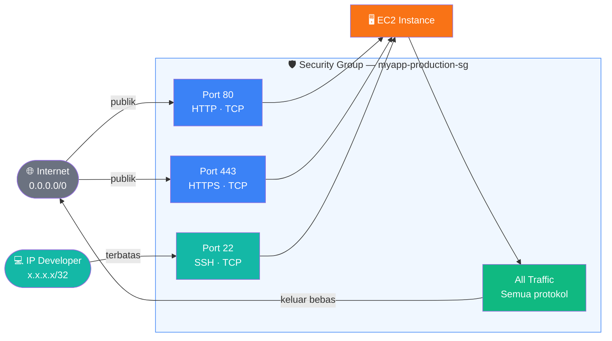

# Dokumentasi — AWS Security Group dengan Terraform

## Gambaran Umum

Kode ini membuat **AWS Security Group** secara deklaratif menggunakan Terraform dalam **1 file tunggal** tanpa variabel terpisah. Security Group berfungsi sebagai firewall virtual yang mengontrol trafik masuk (inbound) dan keluar (outbound) dari EC2 instance.

---

## Diagram Alur Trafik



---

## Isi File `security-group-simple.tf`

```hcl
terraform {
  required_version = ">= 1.5.0"

  required_providers {
    aws = {
      source  = "hashicorp/aws"
      version = "~> 5.0"
    }
  }
}

provider "aws" {
  region = "ap-southeast-1"
}

resource "aws_security_group" "main" {
  name        = "myapp-production-sg"
  description = "Security group untuk EC2 myapp"
  vpc_id      = "vpc-xxxxxxxx"  # Ganti dengan VPC ID kamu

  tags = {
    Name        = "myapp-production-sg"
    Environment = "production"
    ManagedBy   = "terraform"
  }
}

resource "aws_vpc_security_group_ingress_rule" "http" {
  security_group_id = aws_security_group.main.id
  description       = "HTTP dari internet"
  cidr_ipv4         = "0.0.0.0/0"
  from_port         = 80
  to_port           = 80
  ip_protocol       = "tcp"
}

resource "aws_vpc_security_group_ingress_rule" "https" {
  security_group_id = aws_security_group.main.id
  description       = "HTTPS dari internet"
  cidr_ipv4         = "0.0.0.0/0"
  from_port         = 443
  to_port           = 443
  ip_protocol       = "tcp"
}

resource "aws_vpc_security_group_ingress_rule" "ssh" {
  security_group_id = aws_security_group.main.id
  description       = "SSH dari IP developer"
  cidr_ipv4         = "103.10.20.30/32"  # Ganti dengan IP publik kamu
  from_port         = 22
  to_port           = 22
  ip_protocol       = "tcp"
}

resource "aws_vpc_security_group_egress_rule" "all_outbound" {
  security_group_id = aws_security_group.main.id
  description       = "Izinkan semua trafik keluar"
  cidr_ipv4         = "0.0.0.0/0"
  ip_protocol       = "-1"
}

output "security_group_id" {
  value       = aws_security_group.main.id
  description = "ID Security Group — gunakan ini saat membuat EC2"
}
```

---

## Penjelasan Per Blok

### 1. Blok `terraform {}` — Konfigurasi Awal

```hcl
terraform {
  required_version = ">= 1.5.0"
  required_providers {
    aws = {
      source  = "hashicorp/aws"
      version = "~> 5.0"
    }
  }
}
```

Mendefinisikan versi minimum Terraform dan provider AWS yang digunakan. Tanda `~> 5.0` berarti Terraform akan menggunakan versi 5.x manapun tapi tidak lompat ke versi 6.x.

---

### 2. Blok `provider "aws"` — Koneksi ke AWS

```hcl
provider "aws" {
  region = "ap-southeast-1"
}
```

Menentukan region AWS tempat semua resource dibuat. Region `ap-southeast-1` adalah Singapore — terdekat dari Indonesia.

---

### 3. Resource `aws_security_group` — Membuat Security Group

```hcl
resource "aws_security_group" "main" {
  name        = "myapp-production-sg"
  description = "Security group untuk EC2 myapp"
  vpc_id      = "vpc-xxxxxxxx"
  ...
}
```

Membuat Security Group kosong di dalam VPC. Belum ada rules — rules ditambahkan secara terpisah menggunakan resource `aws_vpc_security_group_ingress_rule` dan `aws_vpc_security_group_egress_rule`.

| Atribut | Nilai | Keterangan |
|---------|-------|------------|
| `name` | `myapp-production-sg` | Nama unik di dalam VPC |
| `description` | teks bebas | Wajib diisi di AWS |
| `vpc_id` | `vpc-xxxxxxxx` | VPC tempat security group dibuat |

---

### 4. Inbound Rule — Port 80 (HTTP)

```hcl
resource "aws_vpc_security_group_ingress_rule" "http" {
  security_group_id = aws_security_group.main.id
  cidr_ipv4         = "0.0.0.0/0"
  from_port         = 80
  to_port           = 80
  ip_protocol       = "tcp"
}
```

Mengizinkan semua orang mengakses port 80. `0.0.0.0/0` berarti trafik dari seluruh internet diperbolehkan masuk.

---

### 5. Inbound Rule — Port 443 (HTTPS)

```hcl
resource "aws_vpc_security_group_ingress_rule" "https" {
  security_group_id = aws_security_group.main.id
  cidr_ipv4         = "0.0.0.0/0"
  from_port         = 443
  to_port           = 443
  ip_protocol       = "tcp"
}
```

Sama seperti port 80, tapi untuk HTTPS. Aktifkan setelah sertifikat SSL terpasang di Nginx.

---

### 6. Inbound Rule — Port 22 (SSH)

```hcl
resource "aws_vpc_security_group_ingress_rule" "ssh" {
  security_group_id = aws_security_group.main.id
  cidr_ipv4         = "103.10.20.30/32"  # IP spesifik kamu
  from_port         = 22
  to_port           = 22
  ip_protocol       = "tcp"
}
```

SSH **hanya dibuka dari IP spesifik**. Suffix `/32` artinya tepat 1 alamat IP. Ini mencegah brute-force SSH dari seluruh internet.

> **Cara cek IP publik kamu:**
> ```bash
> curl ifconfig.me
> ```

---

### 7. Outbound Rule — Semua Trafik Keluar

```hcl
resource "aws_vpc_security_group_egress_rule" "all_outbound" {
  security_group_id = aws_security_group.main.id
  cidr_ipv4         = "0.0.0.0/0"
  ip_protocol       = "-1"
}
```

Mengizinkan EC2 mengirim trafik ke mana saja — dibutuhkan agar EC2 bisa `apt update`, `docker pull`, dll. Nilai `"-1"` pada `ip_protocol` berarti semua protokol (TCP, UDP, ICMP).

---

### 8. Output — Tampilkan ID Security Group

```hcl
output "security_group_id" {
  value = aws_security_group.main.id
}
```

Setelah `terraform apply` selesai, Terraform menampilkan ID security group di terminal. ID ini digunakan saat membuat EC2 instance.

---

## Cara Penggunaan

### Langkah 1 — Ganti nilai yang perlu disesuaikan

Buka file `security-group-simple.tf` dan ubah dua baris berikut:

```hcl
# Baris 22 — ganti dengan VPC ID dari AWS Console
vpc_id = "vpc-xxxxxxxx"

# Baris 48 — ganti dengan IP publik kamu (hasil dari: curl ifconfig.me)
cidr_ipv4 = "103.10.20.30/32"
```

### Langkah 2 — Jalankan Terraform

```bash
# Download provider AWS
terraform init

# Preview resource yang akan dibuat
terraform plan

# Buat security group di AWS
terraform apply
# Ketik "yes" saat diminta konfirmasi
```

### Langkah 3 — Salin output ID

Setelah selesai, Terraform menampilkan:

```
Outputs:
security_group_id = "sg-0abc123def456789"
```

Gunakan ID ini saat membuat EC2 instance:

```hcl
resource "aws_instance" "app" {
  ami                    = "ami-xxxxxxxxxxxxxxxxx"
  instance_type          = "t3.micro"
  vpc_security_group_ids = ["sg-0abc123def456789"]  # ← ID dari output
}
```

---

## Cara Mencari VPC ID

Jika belum tahu VPC ID, jalankan perintah berikut:

```bash
aws ec2 describe-vpcs \
  --region ap-southeast-1 \
  --query "Vpcs[*].{ID:VpcId,CIDR:CidrBlock,Default:IsDefault}" \
  --output table
```

Contoh output:

```
-------------------------------------------
|            DescribeVpcs                 |
+------------------+-----------+----------+
|       CIDR       |  Default  |    ID    |
+------------------+-----------+----------+
| 172.31.0.0/16    |  True     | vpc-abc  |
+------------------+-----------+----------+
```

Salin nilai dari kolom `ID` dan paste ke `vpc_id` di dalam file `.tf`.

---

## Referensi Rules

| Rule | Tipe | Port | Protokol | Source | Keterangan |
|------|------|------|----------|--------|------------|
| `http` | Inbound | 80 | TCP | `0.0.0.0/0` | HTTP dari internet |
| `https` | Inbound | 443 | TCP | `0.0.0.0/0` | HTTPS dari internet |
| `ssh` | Inbound | 22 | TCP | `IP kamu/32` | SSH terbatas |
| `all_outbound` | Outbound | All | All | `0.0.0.0/0` | Semua keluar |

---

## Catatan Penting

> **`aws_vpc_security_group_ingress_rule`** adalah resource yang direkomendasikan di AWS Provider versi 5.x ke atas — menggantikan blok `ingress {}` lama di dalam `aws_security_group`. Keduanya bekerja, tapi jangan dicampur dalam satu security group karena bisa menyebabkan konflik state.

---

## Referensi Terraform Registry

- [aws_security_group](https://registry.terraform.io/providers/hashicorp/aws/latest/docs/resources/security_group)
- [aws_vpc_security_group_ingress_rule](https://registry.terraform.io/providers/hashicorp/aws/latest/docs/resources/vpc_security_group_ingress_rule)
- [aws_vpc_security_group_egress_rule](https://registry.terraform.io/providers/hashicorp/aws/latest/docs/resources/vpc_security_group_egress_rule)
