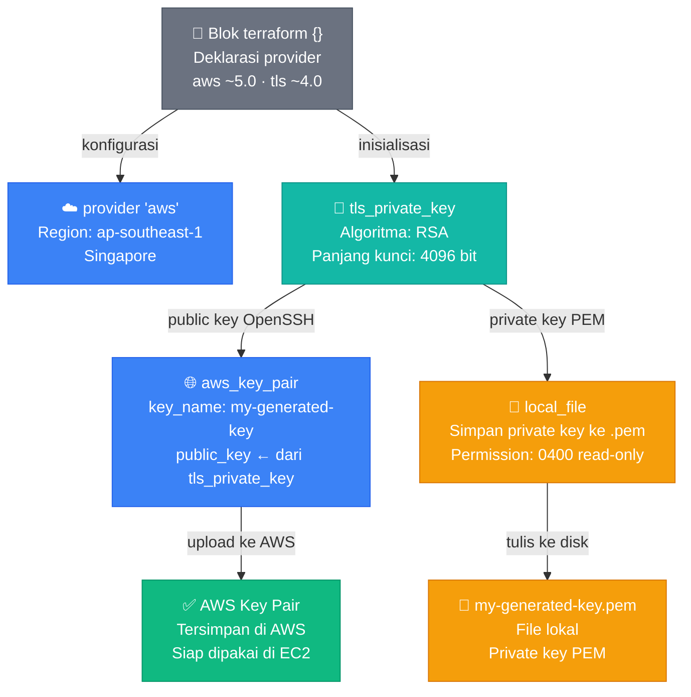

# Penjelasan Kode Terraform — AWS Key Pair

## Gambaran Umum

Kode ini membuat **AWS Key Pair** secara otomatis menggunakan Terraform. Prosesnya melibatkan tiga langkah utama: generate key pair secara lokal, upload public key ke AWS, lalu simpan private key ke file lokal.

---

## Alur Eksekusi

```
terraform init
    └── Download provider: hashicorp/aws & hashicorp/tls

terraform apply
    ├── tls_private_key  → generate RSA 4096-bit key pair (lokal)
    ├── aws_key_pair     → upload public key ke AWS
    └── local_file       → simpan private key ke .pem (lokal)
```

---

## Diagram Alur Resource



> **Catatan:** Diagram Mermaid dirender otomatis di GitHub, GitLab, Obsidian, dan VS Code (dengan ekstensi Markdown Preview Mermaid Support).

---

## Penjelasan Per Blok

### 1. Blok `terraform {}` — Konfigurasi Awal

```hcl
terraform {
  required_providers {
    aws = {
      source  = "hashicorp/aws"
      version = "~> 5.0"
    }
    tls = {
      source  = "hashicorp/tls"
      version = "~> 4.0"
    }
  }
}
```

Blok ini adalah **deklarasi kebutuhan proyek**. `required_providers` mendaftarkan dua provider yang akan diunduh saat `terraform init` dijalankan.

| Provider | Fungsi |
|----------|--------|
| `hashicorp/aws` | Berinteraksi dengan layanan AWS |
| `hashicorp/tls` | Generate key pair secara lokal |

Tanda `~> 5.0` artinya Terraform boleh menggunakan versi **5.x manapun**, tapi tidak boleh lompat ke versi 6.x — ini menjaga kompatibilitas kode.

---

### 2. Blok `provider "aws"` — Koneksi ke AWS

```hcl
provider "aws" {
  region = "ap-southeast-1"
}
```

Memberitahu Terraform bahwa semua resource AWS akan dibuat di region **ap-southeast-1 (Singapore)**. Kredensial AWS dibaca otomatis dari environment variable atau file `~/.aws/credentials`.

---

### 3. Resource `tls_private_key` — Generate Key Pair

```hcl
resource "tls_private_key" "my_key" {
  algorithm = "RSA"
  rsa_bits  = 4096
}
```

Terraform menggunakan provider `tls` untuk **generate pasangan kunci RSA 4096-bit** secara lokal. Hasilnya dua nilai penting yang bisa direferensikan oleh resource lain:

| Atribut | Isi |
|---------|-----|
| `tls_private_key.my_key.public_key_openssh` | Public key dalam format OpenSSH |
| `tls_private_key.my_key.private_key_pem` | Private key dalam format PEM |

> **Perhatian:** Private key tersimpan dalam Terraform state file dalam bentuk plaintext. Untuk production, simpan ke AWS Secrets Manager.

---

### 4. Resource `aws_key_pair` — Upload ke AWS

```hcl
resource "aws_key_pair" "my_key" {
  key_name   = "my-generated-key"
  public_key = tls_private_key.my_key.public_key_openssh

  tags = {
    Name = "my-generated-key"
  }
}
```

Mengambil **public key** dari resource `tls_private_key` dan menguploadnya ke AWS. Setelah ini, key pair bernama `my-generated-key` akan muncul di:

```
AWS Console → EC2 → Key Pairs
```

AWS **hanya menyimpan public key** — private key tetap di tangan kamu. Tag `Name` digunakan untuk identifikasi di console AWS.

---

### 5. Resource `local_file` — Simpan Private Key

```hcl
resource "local_file" "private_key" {
  content         = tls_private_key.my_key.private_key_pem
  filename        = "${path.module}/my-generated-key.pem"
  file_permission = "0400"
}
```

Menyimpan **private key** ke file `.pem` di komputer lokal.

| Atribut | Nilai | Keterangan |
|---------|-------|------------|
| `content` | `private_key_pem` | Isi file berupa private key PEM |
| `filename` | `./my-generated-key.pem` | Lokasi file (direktori yang sama dengan `main.tf`) |
| `file_permission` | `0400` | Read-only untuk pemilik — standar keamanan SSH key |

`${path.module}` adalah variabel bawaan Terraform yang merujuk ke direktori tempat file `main.tf` berada.

---

## Cara Penggunaan

### Jalankan Terraform

```bash
# Inisialisasi — download provider
terraform init

# Preview perubahan
terraform plan

# Terapkan ke AWS
terraform apply
```

### SSH ke EC2 Menggunakan Key

```bash
ssh -i ./my-generated-key.pem ec2-user@<IP_EC2>
```

---

## Catatan Keamanan

| # | Risiko | Rekomendasi |
|---|--------|-------------|
| 1 | Private key tersimpan di Terraform state | Gunakan AWS Secrets Manager untuk production |
| 2 | File `.pem` di direktori lokal | Tambahkan `*.pem` ke `.gitignore` |
| 3 | Provider `local` tidak dideklarasikan | Tambahkan `hashicorp/local ~> 2.0` ke `required_providers` |
| 4 | Tidak ada `required_version` | Tambahkan `required_version = ">= 1.5.0"` |

---

## Referensi

- [Terraform AWS Provider Docs](https://registry.terraform.io/providers/hashicorp/aws/latest/docs)
- [Resource: aws_key_pair](https://registry.terraform.io/providers/hashicorp/aws/latest/docs/resources/key_pair)
- [Resource: tls_private_key](https://registry.terraform.io/providers/hashicorp/tls/latest/docs/resources/private_key)
- [Resource: local_file](https://registry.terraform.io/providers/hashicorp/local/latest/docs/resources/file)