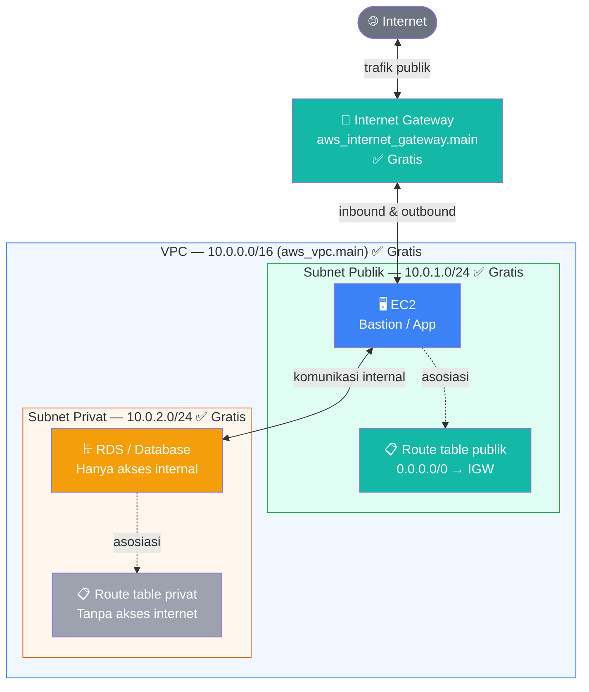
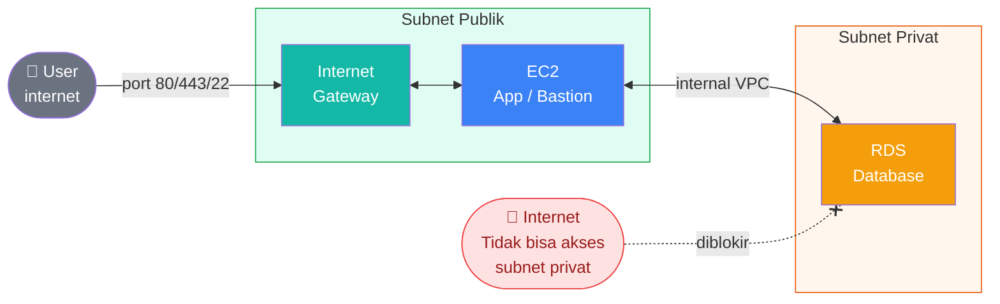

# Dokumentasi — AWS VPC dengan Terraform (Free Tier)

## Gambaran Umum

Kode ini membuat **AWS VPC (Virtual Private Cloud)** lengkap menggunakan Terraform dalam 1 file tanpa variabel. Dirancang agar **100% kompatibel dengan AWS Free Tier** — tidak menggunakan NAT Gateway maupun Elastic IP yang dikenakan biaya.

VPC adalah jaringan virtual terisolasi di AWS tempat semua resource seperti EC2 dan RDS berjalan dengan keamanan dan kontrol penuh.

---

## Status Free Tier

| Resource | Status | Biaya |
|----------|--------|-------|
| `aws_vpc` | ✅ Gratis | Tidak dikenakan biaya |
| `aws_internet_gateway` | ✅ Gratis | Tidak dikenakan biaya |
| `aws_subnet` | ✅ Gratis | Tidak dikenakan biaya |
| `aws_route_table` | ✅ Gratis | Tidak dikenakan biaya |
| `aws_route_table_association` | ✅ Gratis | Tidak dikenakan biaya |
| ~~`aws_nat_gateway`~~ | ❌ Dihapus | ~$0.045/jam + $0.045/GB |
| ~~`aws_eip`~~ | ❌ Dihapus | ~$0.005/jam jika tidak dipakai |

---

## Diagram Arsitektur



---

## Alur Trafik



---

## Resource yang Dibuat

| Resource | Nama | Keterangan |
|----------|------|------------|
| `aws_vpc` | `myapp-vpc` | Jaringan virtual utama, CIDR 10.0.0.0/16 |
| `aws_internet_gateway` | `myapp-igw` | Pintu keluar masuk ke internet |
| `aws_subnet` (publik) | `myapp-subnet-public` | Untuk EC2 dan resource dengan IP publik |
| `aws_subnet` (privat) | `myapp-subnet-private` | Untuk database dan resource terisolasi |
| `aws_route_table` (publik) | `myapp-rt-public` | Route 0.0.0.0/0 → IGW |
| `aws_route_table` (privat) | `myapp-rt-private` | Hanya komunikasi internal VPC |
| `aws_route_table_association` ×2 | — | Hubungkan subnet ke route table |

---

## Penjelasan Per Blok

### 1. VPC Utama

```hcl
resource "aws_vpc" "main" {
  cidr_block           = "10.0.0.0/16"
  enable_dns_hostnames = true
  enable_dns_support   = true
}
```

VPC adalah jaringan virtual yang terisolasi dari jaringan AWS lain. CIDR `10.0.0.0/16` menyediakan **65.536 IP address** yang bisa dibagi ke subnet-subnet di dalamnya.

| Atribut | Nilai | Keterangan |
|---------|-------|------------|
| `cidr_block` | `10.0.0.0/16` | Rentang IP seluruh VPC |
| `enable_dns_hostnames` | `true` | EC2 mendapat hostname otomatis (misal: `ec2-54-xx.compute.amazonaws.com`) |
| `enable_dns_support` | `true` | Aktifkan DNS resolver bawaan AWS |

---

### 2. Internet Gateway

```hcl
resource "aws_internet_gateway" "main" {
  vpc_id = aws_vpc.main.id
}
```

Internet Gateway (IGW) adalah komponen yang menghubungkan VPC ke internet. Tanpa IGW, tidak ada resource di VPC yang bisa diakses dari luar maupun mengakses internet. **Satu VPC hanya boleh memiliki satu IGW** dan tidak dikenakan biaya.

---

### 3. Subnet Publik

```hcl
resource "aws_subnet" "public" {
  vpc_id                  = aws_vpc.main.id
  cidr_block              = "10.0.1.0/24"
  availability_zone       = "ap-southeast-1a"
  map_public_ip_on_launch = true
}
```

Subnet publik adalah subnet yang route table-nya mengarah ke Internet Gateway sehingga resource di dalamnya **bisa diakses dari internet**. `map_public_ip_on_launch = true` membuat EC2 yang diluncurkan di sini otomatis mendapat IP publik tanpa perlu Elastic IP.

CIDR `10.0.1.0/24` menyediakan 256 alamat IP, dikurangi 5 yang direservasi AWS = **251 IP yang bisa digunakan**.

---

### 4. Subnet Privat

```hcl
resource "aws_subnet" "private" {
  vpc_id            = aws_vpc.main.id
  cidr_block        = "10.0.2.0/24"
  availability_zone = "ap-southeast-1a"
}
```

Subnet privat **tidak bisa diakses dari internet** karena route table-nya tidak memiliki route ke IGW maupun NAT Gateway. Resource di sini (database, cache) hanya bisa diakses dari resource lain di dalam VPC yang sama — inilah yang membuatnya aman untuk data sensitif.

> **Catatan:** Tanpa NAT Gateway, resource di subnet privat juga **tidak bisa mengakses internet** (tidak bisa `apt update`, `docker pull`, dll). Ini adalah trade-off yang diterima untuk menjaga biaya tetap nol.

---

### 5. Route Table Publik

```hcl
resource "aws_route_table" "public" {
  vpc_id = aws_vpc.main.id

  route {
    cidr_block = "0.0.0.0/0"
    gateway_id = aws_internet_gateway.main.id
  }
}

resource "aws_route_table_association" "public" {
  subnet_id      = aws_subnet.public.id
  route_table_id = aws_route_table.public.id
}
```

Route table menentukan kemana trafik diarahkan. Route `0.0.0.0/0 → IGW` artinya semua trafik yang tidak menuju IP lokal VPC dikirim ke Internet Gateway. Asosiasi menghubungkan route table ini ke subnet publik.

---

### 6. Route Table Privat

```hcl
resource "aws_route_table" "private" {
  vpc_id = aws_vpc.main.id
  # Tidak ada route 0.0.0.0/0
}

resource "aws_route_table_association" "private" {
  subnet_id      = aws_subnet.private.id
  route_table_id = aws_route_table.private.id
}
```

Route table privat **sengaja tidak memiliki route ke internet**. AWS secara otomatis menambahkan route lokal `10.0.0.0/16 → local` sehingga antar-subnet di dalam VPC tetap bisa saling berkomunikasi. Asosiasi menghubungkan route table ini ke subnet privat.

---

## Cara Penggunaan

### Langkah 1 — Jalankan Terraform

Tidak ada nilai yang perlu diubah, kode langsung bisa dijalankan:

```bash
# Download provider AWS
terraform init

# Preview resource yang akan dibuat
terraform plan

# Buat semua resource di AWS
terraform apply
# Ketik "yes" saat diminta konfirmasi
```

### Langkah 2 — Lihat Output

Setelah selesai, Terraform menampilkan:

```
Outputs:

internet_gateway_id    = "igw-0abc123def456789"
private_route_table_id = "rtb-0abc123def456789"
private_subnet_id      = "subnet-0abc123def456789"
public_route_table_id  = "rtb-0def456abc123789"
public_subnet_id       = "subnet-0def456abc123789"
vpc_cidr               = "10.0.0.0/16"
vpc_id                 = "vpc-0abc123def456789"
```

### Langkah 3 — Gunakan di Resource Lain

Gunakan output ini saat membuat Security Group dan EC2:

```hcl
# Security Group menggunakan VPC ini
resource "aws_security_group" "app" {
  vpc_id = "vpc-0abc123def456789"  # dari output vpc_id
}

# EC2 di subnet publik — bisa diakses dari internet
resource "aws_instance" "app" {
  ami           = "ami-xxxxxxxxxxxxxxxxx"
  instance_type = "t3.micro"
  subnet_id     = "subnet-0def456abc123789"  # dari output public_subnet_id
  key_name      = "myapp-keypair"
  vpc_security_group_ids = [aws_security_group.app.id]
}

# RDS di subnet privat — hanya akses internal
resource "aws_db_instance" "main" {
  db_subnet_group_name = "subnet-0abc123def456789"  # dari output private_subnet_id
}
```

---

## Pembagian CIDR

| Subnet | CIDR | Total IP | Usable IP | Kegunaan |
|--------|------|----------|-----------|----------|
| VPC | `10.0.0.0/16` | 65.536 | — | Seluruh jaringan virtual |
| Subnet publik | `10.0.1.0/24` | 256 | 251 | EC2, Load Balancer |
| Subnet privat | `10.0.2.0/24` | 256 | 251 | Database, App internal |

> AWS mereservasi **5 IP** di setiap subnet: network address, VPC router, DNS, future use, dan broadcast — sehingga dari 256 IP di `/24` hanya 251 yang bisa digunakan.

---

## Perbandingan: Free Tier vs Full Setup

| Fitur | Free Tier (kode ini) | Full Setup |
|-------|----------------------|------------|
| VPC + Subnet | ✅ | ✅ |
| Internet Gateway | ✅ | ✅ |
| Subnet publik bisa akses internet | ✅ | ✅ |
| Subnet privat bisa akses internet | ❌ | ✅ (via NAT GW) |
| NAT Gateway | ❌ Dihapus | ✅ ~$0.045/jam |
| Elastic IP | ❌ Dihapus | ✅ ~$0.005/jam |
| Biaya per bulan | **$0** | ~$35–$50 |

---

## Upgrade ke Full Setup (Jika Dibutuhkan)

Jika nantinya subnet privat perlu akses internet, tambahkan kembali ketiga resource berikut:

```hcl
# 1. Elastic IP untuk NAT Gateway
resource "aws_eip" "nat" {
  domain     = "vpc"
  depends_on = [aws_internet_gateway.main]
  tags = { Name = "myapp-eip-nat" }
}

# 2. NAT Gateway di subnet publik
resource "aws_nat_gateway" "main" {
  allocation_id = aws_eip.nat.id
  subnet_id     = aws_subnet.public.id
  depends_on    = [aws_internet_gateway.main]
  tags = { Name = "myapp-nat-gateway" }
}

# 3. Tambahkan route ke route table privat
resource "aws_route" "private_nat" {
  route_table_id         = aws_route_table.private.id
  destination_cidr_block = "0.0.0.0/0"
  nat_gateway_id         = aws_nat_gateway.main.id
}
```

---

## Referensi Terraform Registry

- [aws_vpc](https://registry.terraform.io/providers/hashicorp/aws/latest/docs/resources/vpc)
- [aws_internet_gateway](https://registry.terraform.io/providers/hashicorp/aws/latest/docs/resources/internet_gateway)
- [aws_subnet](https://registry.terraform.io/providers/hashicorp/aws/latest/docs/resources/subnet)
- [aws_route_table](https://registry.terraform.io/providers/hashicorp/aws/latest/docs/resources/route_table)
- [aws_route_table_association](https://registry.terraform.io/providers/hashicorp/aws/latest/docs/resources/route_table_association)
