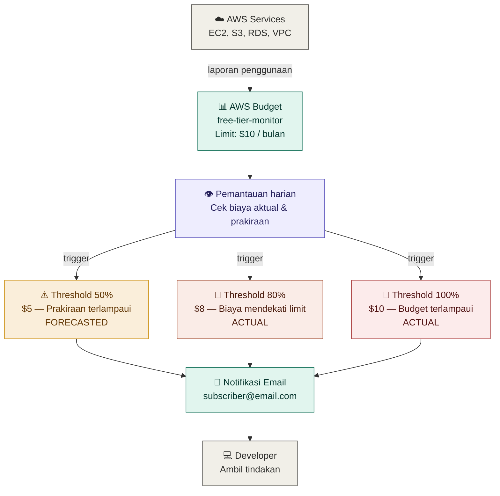
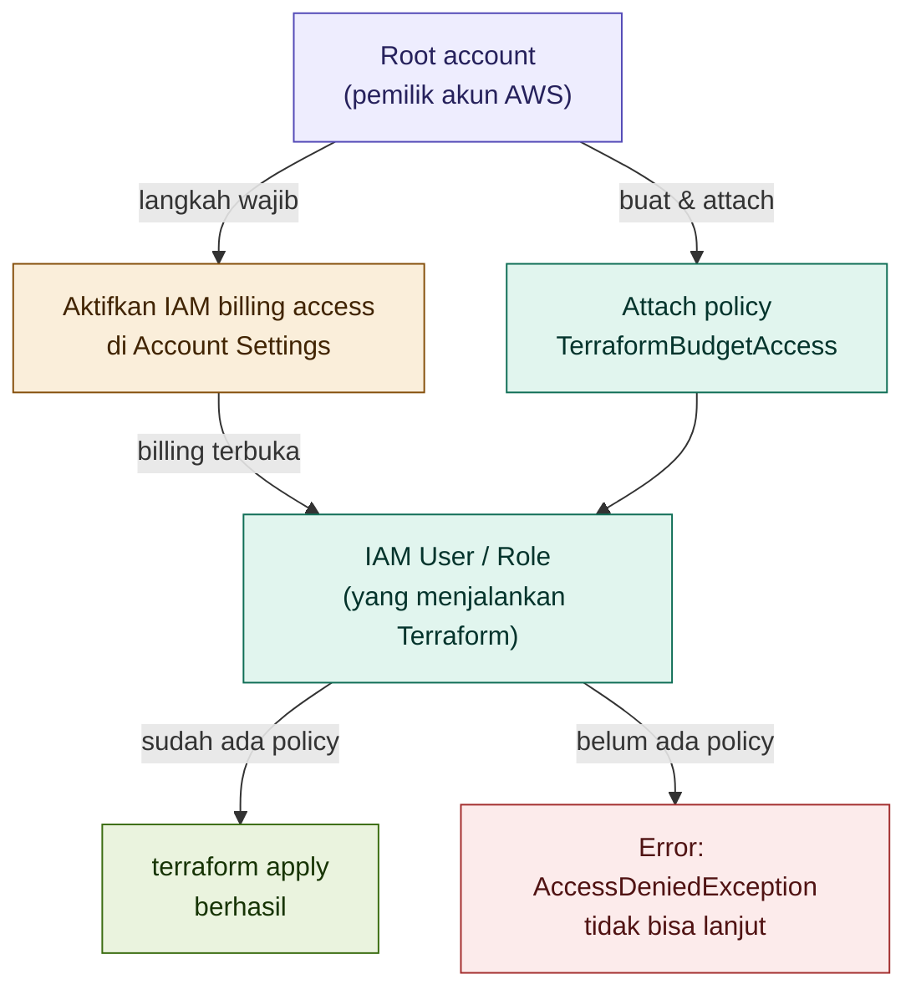
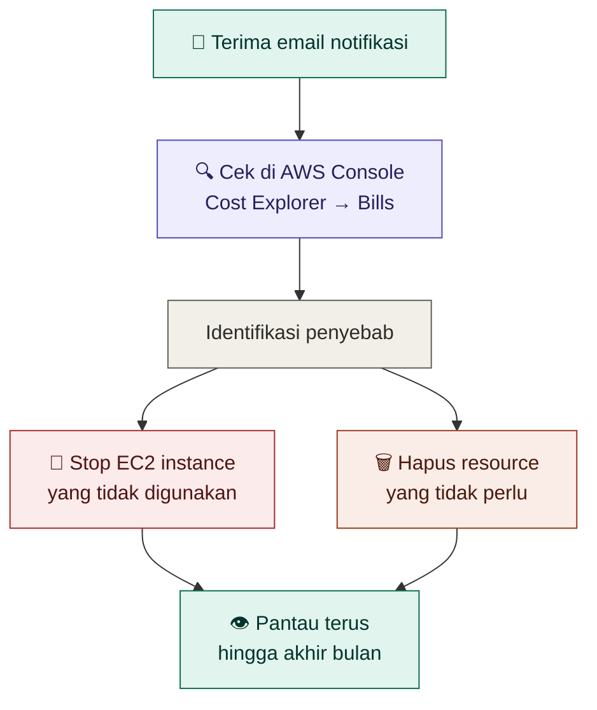

# Dokumentasi — AWS Budget dengan Terraform (Free Tier Monitor)

## Gambaran Umum

Kode ini membuat **AWS Budget** untuk memantau penggunaan biaya AWS agar tidak melebihi batas Free Tier. Terraform akan membuat dua budget sekaligus — satu untuk memantau **total biaya** dan satu khusus untuk **penggunaan EC2**.

Notifikasi email dikirim secara otomatis saat penggunaan mendekati atau melampaui batas yang ditentukan.

---

## Status Free Tier

| Resource | Status | Biaya |
|----------|--------|-------|
| `aws_budgets_budget` | ✅ Gratis | 2 budget pertama gratis, $0.02/budget/hari setelahnya |

> AWS memberikan **2 budget gratis** per akun per bulan. Kode ini membuat tepat 2 budget sehingga masih dalam batas gratis.

---

## Diagram Alur Notifikasi



---

## Budget yang Dibuat

### Budget 1 — Total Biaya Bulanan

| Pengaturan | Nilai | Keterangan |
|------------|-------|------------|
| `budget_type` | `COST` | Pantau berdasarkan biaya |
| `limit_amount` | `$10` | Batas aman di atas free tier |
| `time_unit` | `MONTHLY` | Reset setiap awal bulan |

| Notifikasi | Threshold | Tipe | Keterangan |
|------------|-----------|------|------------|
| 1 | 50% ($5) | `FORECASTED` | Prakiraan sudah setengah batas |
| 2 | 80% ($8) | `ACTUAL` | Biaya nyata mendekati limit |
| 3 | 100% ($10) | `ACTUAL` | Budget terlampaui |

---

### Budget 2 — Penggunaan EC2

| Pengaturan | Nilai | Keterangan |
|------------|-------|------------|
| `budget_type` | `USAGE` | Pantau berdasarkan jam penggunaan |
| `limit_amount` | `750 Hrs` | Batas free tier EC2 per bulan |
| `time_unit` | `MONTHLY` | Reset setiap awal bulan |
| `cost_filter` | EC2 only | Hanya layanan EC2 |

| Notifikasi | Threshold | Tipe | Keterangan |
|------------|-----------|------|------------|
| 1 | 80% (600 jam) | `ACTUAL` | EC2 sudah berjalan 600 jam |
| 2 | 100% (750 jam) | `ACTUAL` | Free tier EC2 habis |

---

## Penjelasan Per Blok

### 1. Budget Biaya Keseluruhan

```hcl
resource "aws_budgets_budget" "free_tier" {
  name         = "free-tier-monitor"
  budget_type  = "COST"
  limit_amount = "10"
  limit_unit   = "USD"
  time_unit    = "MONTHLY"
  ...
}
```

`budget_type = "COST"` berarti budget memantau **biaya dalam USD** yang muncul di tagihan AWS. Limit diset `$10` sebagai buffer aman — jika biaya muncul (seharusnya nol saat free tier), notifikasi langsung dikirim.

---

### 2. Blok Notifikasi

```hcl
notification {
  comparison_operator        = "GREATER_THAN"
  threshold                  = 50
  threshold_type             = "PERCENTAGE"
  notification_type          = "FORECASTED"
  subscriber_email_addresses = ["emailkamu@gmail.com"]
}
```

| Atribut | Nilai | Keterangan |
|---------|-------|------------|
| `comparison_operator` | `GREATER_THAN` | Trigger saat melebihi threshold |
| `threshold` | `50` | 50% dari limit budget |
| `threshold_type` | `PERCENTAGE` | Threshold dalam persentase |
| `notification_type` | `FORECASTED` / `ACTUAL` | Prakiraan atau biaya nyata |
| `subscriber_email_addresses` | email kamu | Penerima notifikasi |

Perbedaan `FORECASTED` vs `ACTUAL`:
- `FORECASTED` — AWS memprediksi biaya akhir bulan akan melampaui threshold. Berguna untuk peringatan dini.
- `ACTUAL` — Biaya yang sudah benar-benar terjadi sudah melampaui threshold. Lebih akurat tapi lebih terlambat.

---

### 3. Budget Penggunaan EC2

```hcl
resource "aws_budgets_budget" "ec2_usage" {
  budget_type  = "USAGE"
  limit_amount = "750"
  limit_unit   = "Hrs"

  cost_filter {
    name   = "UsageTypeGroup"
    values = ["EC2: Running Hours"]
  }
  ...
}
```

`budget_type = "USAGE"` memantau **jam penggunaan** bukan biaya. Free tier EC2 memberikan 750 jam/bulan untuk instance `t2.micro` atau `t3.micro`.

Penting: `budget_type = "USAGE"` hanya mendukung dimensi filter tertentu — berbeda dengan `budget_type = "COST"`. Menggunakan dimensi yang salah akan menyebabkan error `InvalidParameterException`.

| Dimensi filter | Valid untuk `COST` | Valid untuk `USAGE` |
|----------------|:------------------:|:-------------------:|
| `Service` | ✅ | ❌ |
| `UsageTypeGroup` | ✅ | ✅ |
| `UsageType` | ✅ | ✅ |
| `Operation` | ✅ | ✅ |
| `Region` | ✅ | ✅ |
| `InstanceType` | ✅ | ✅ |
| `LinkedAccount` | ✅ | ✅ |
| `AZ` | ✅ | ✅ |
| `PurchaseType` | ✅ | ✅ |

Untuk memantau jam EC2, gunakan `UsageTypeGroup` dengan nilai `"EC2: Running Hours"` — ini mencakup semua jam instance EC2 yang sedang berjalan tanpa perlu menyebutkan region atau tipe instance secara spesifik.

---

## Permission yang Dibutuhkan untuk AWS Budget

Sebelum menjalankan Terraform, pastikan IAM user atau role yang digunakan memiliki permission yang cukup. Ada dua level permission yang perlu dikonfigurasi.

### A. Permission IAM untuk menjalankan Terraform

IAM user yang menjalankan `terraform apply` membutuhkan permission berikut:

```json
{
  "Version": "2012-10-17",
  "Statement": [
    {
      "Sid": "BudgetFullAccess",
      "Effect": "Allow",
      "Action": [
        "budgets:CreateBudget",
        "budgets:ModifyBudget",
        "budgets:DeleteBudget",
        "budgets:ViewBudget",
        "budgets:DescribeBudgets",
        "budgets:DescribeBudgetActionsForBudget",
        "budgets:DescribeBudgetPerformanceHistory"
      ],
      "Resource": "*"
    },
    {
      "Sid": "BillingReadAccess",
      "Effect": "Allow",
      "Action": [
        "aws-portal:ViewBilling",
        "aws-portal:ViewUsage",
        "ce:GetCostAndUsage",
        "ce:GetUsageAndCostForecast"
      ],
      "Resource": "*"
    }
  ]
}
```

Cara menambahkan permission di AWS Console:

```
AWS Console → IAM → Users → [nama user kamu]
  → Add permissions → Attach policies directly
  → Create policy → JSON → paste policy di atas
  → Beri nama: "TerraformBudgetAccess" → Create policy
```

Atau gunakan **AWS managed policy** yang sudah tersedia:

| Managed Policy | Keterangan |
|----------------|------------|
| `AWSBudgetsActionsWithAWSResourceControlAccess` | Akses penuh ke Budget |
| `AWSBudgetsReadOnlyAccess` | Hanya baca budget (tidak bisa create/delete) |
| `Billing` | Akses penuh ke semua fitur billing termasuk budget |

---

### B. Aktifkan akses billing untuk IAM user

Secara default, hanya **root account** yang bisa melihat data billing. IAM user biasa tidak bisa mengakses billing meskipun sudah punya permission `budgets:*`. Langkah ini wajib dilakukan oleh **root account**:

```
1. Login sebagai root account (bukan IAM user)
2. Klik nama akun di pojok kanan atas → "Account"
3. Scroll ke bagian "IAM user and role access to billing information"
4. Klik "Edit" → centang "Activate IAM Access"
5. Klik "Update"
```

> Tanpa langkah ini, `terraform apply` akan gagal dengan error:
> `AccessDeniedException: User is not authorized to view billing data`

---

### C. Diagram alur permission



---

### D. Verifikasi permission sebelum apply

Jalankan perintah berikut untuk memastikan IAM user sudah bisa akses budget:

```bash
# Cek identity yang sedang digunakan
aws sts get-caller-identity

# Coba list budget yang ada (harusnya kosong jika belum ada)
aws budgets describe-budgets \
  --account-id $(aws sts get-caller-identity --query Account --output text)

# Jika output "An error occurred (AccessDeniedException)"
# berarti permission belum cukup — ulangi langkah A dan B
```

---

## Cara Penggunaan

### Langkah 1 — Ganti alamat email

Buka `budget-simple.tf` dan ganti semua `emailkamu@gmail.com` dengan email kamu:

```hcl
subscriber_email_addresses = ["emailkamu@gmail.com"]  # ← ganti ini
```

### Langkah 2 — Aktifkan AWS Billing di IAM

Budget memerlukan akses ke data billing. Pastikan sudah diaktifkan di AWS Console oleh root account (lihat panduan permission bagian B di atas):

```
AWS Console → Account → IAM User and Role Access to Billing → Activate
```

### Langkah 3 — Jalankan Terraform

```bash
terraform init
terraform plan
terraform apply
# Ketik "yes" saat diminta konfirmasi
```

### Langkah 4 — Konfirmasi email

Setelah `apply` selesai, AWS mengirim email konfirmasi ke alamat yang didaftarkan. **Klik link konfirmasi** di email tersebut agar notifikasi bisa diterima.

### Langkah 5 — Verifikasi di AWS Console

```
AWS Console → Billing → Budgets
```

Dua budget akan muncul:
- `free-tier-monitor` — memantau total biaya
- `ec2-free-tier-monitor` — memantau jam EC2

---

## Output Setelah Apply

```
Outputs:

budget_cost_id    = "free-tier-monitor:xxxx-xxxx-xxxx"
budget_cost_limit = "10 USD"
budget_ec2_id     = "ec2-free-tier-monitor:xxxx-xxxx-xxxx"
budget_ec2_limit  = "750 Hrs per bulan"
```

---

## Contoh Email Notifikasi

Saat threshold terlampaui, AWS mengirim email seperti ini:

```
From: AWS Notifications <no-reply@sns.amazonaws.com>
Subject: AWS Budget Notification - free-tier-monitor

AWS Budget Notification

Budget name: free-tier-monitor
Budget type: Cost
Budgeted amount: $10.00
Alert threshold: > 80% of budgeted amount
ACTUAL amount: $8.50 (85.00% of budgeted amount)
```

---

## Batas Free Tier AWS yang Perlu Dipantau

| Layanan | Free Tier Limit | Keterangan |
|---------|----------------|------------|
| EC2 | 750 jam/bulan | t2.micro atau t3.micro |
| S3 | 5 GB storage | 20.000 GET + 2.000 PUT request |
| RDS | 750 jam/bulan | db.t2.micro atau db.t3.micro |
| Lambda | 1 juta request/bulan | 400.000 GB-detik compute |
| CloudWatch | 10 metric custom | Log 5 GB |
| Data Transfer | 100 GB/bulan | Keluar ke internet |

> Free tier berlaku **12 bulan** sejak pendaftaran akun AWS, kecuali Lambda dan beberapa layanan lain yang **selamanya gratis**.

---

## Tindakan Saat Menerima Notifikasi



---

## Referensi Terraform Registry

- [aws_budgets_budget](https://registry.terraform.io/providers/hashicorp/aws/latest/docs/resources/budgets_budget)
- [AWS Free Tier](https://aws.amazon.com/free/)
- [AWS Budgets Pricing](https://aws.amazon.com/aws-cost-management/aws-budgets/pricing/)