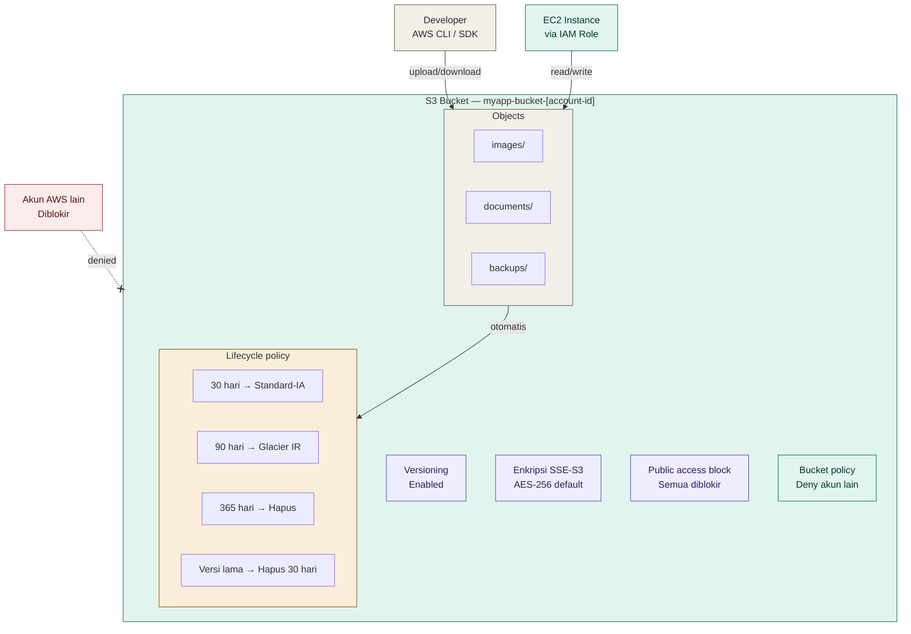
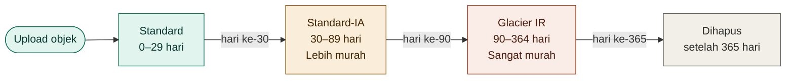

# Dokumentasi — AWS S3 Bucket dengan Terraform (Free Tier)

## Gambaran Umum

Kode ini membuat **AWS S3 Bucket** lengkap menggunakan Terraform dalam 1 file tanpa variabel. Dirancang agar kompatibel dengan **AWS Free Tier** dan dilengkapi fitur keamanan serta pengelolaan otomatis agar storage tetap di batas gratis.

---

## Status Free Tier

| Resource | Status | Batas Free Tier |
|----------|--------|-----------------|
| `aws_s3_bucket` | ✅ Gratis | 5 GB storage / bulan |
| `aws_s3_bucket_versioning` | ⚠️ Hati-hati | Versi lama ikut dihitung ke 5 GB |
| `aws_s3_bucket_server_side_encryption_configuration` | ✅ Gratis | SSE-S3 tidak ada biaya tambahan |
| `aws_s3_bucket_public_access_block` | ✅ Gratis | Tidak ada biaya |
| `aws_s3_bucket_lifecycle_configuration` | ✅ Gratis | Lifecycle rules tidak dikenakan biaya |
| `aws_s3_bucket_policy` | ✅ Gratis | Bucket policy tidak dikenakan biaya |

> Free tier S3 berlaku **12 bulan** sejak pendaftaran akun AWS. Setelah itu dikenakan biaya ~$0.023/GB/bulan untuk region ap-southeast-1.

---

## Diagram Arsitektur



---

## Alur Lifecycle Object



---

## Resource yang Dibuat

| Resource | Keterangan |
|----------|------------|
| `aws_s3_bucket` | Bucket utama dengan nama unik berbasis account ID |
| `aws_s3_bucket_versioning` | Simpan riwayat setiap versi objek |
| `aws_s3_bucket_server_side_encryption_configuration` | Enkripsi otomatis AES-256 |
| `aws_s3_bucket_public_access_block` | Blokir semua akses publik |
| `aws_s3_bucket_lifecycle_configuration` | Kelola transisi & penghapusan otomatis |
| `aws_s3_bucket_policy` | Tolak akses dari akun AWS lain |

---

## Penjelasan Per Blok

### 1. Nama Bucket — Unik Secara Global

```hcl
data "aws_caller_identity" "current" {}

resource "aws_s3_bucket" "main" {
  bucket = "myapp-bucket-${data.aws_caller_identity.current.account_id}"
}
```

Nama S3 bucket harus **unik secara global** di seluruh AWS — tidak boleh sama dengan bucket milik orang lain di seluruh dunia. Dengan menambahkan `account_id` (12 digit unik per akun), nama bucket dijamin tidak bentrok. `data.aws_caller_identity` membaca account ID secara otomatis tanpa perlu diisi manual.

---

### 2. Versioning

```hcl
resource "aws_s3_bucket_versioning" "main" {
  bucket = aws_s3_bucket.main.id
  versioning_configuration {
    status = "Enabled"
  }
}
```

Versioning menyimpan **setiap versi** dari setiap objek yang pernah diupload atau diubah. Jika file terhapus tidak sengaja atau tertimpa, versi sebelumnya masih bisa dipulihkan.

> Perhatian: semua versi lama ikut dihitung ke total storage. Lifecycle rule `cleanup-old-versions` secara otomatis menghapus versi lama setelah 30 hari agar storage tidak membengkak.

---

### 3. Enkripsi Server-Side (SSE-S3)

```hcl
resource "aws_s3_bucket_server_side_encryption_configuration" "main" {
  bucket = aws_s3_bucket.main.id
  rule {
    apply_server_side_encryption_by_default {
      sse_algorithm = "AES256"
    }
    bucket_key_enabled = true
  }
}
```

Semua objek yang diupload ke bucket ini **dienkripsi otomatis** menggunakan AES-256 sebelum disimpan di disk AWS. Proses enkripsi dan dekripsi transparan — tidak perlu mengubah cara upload/download. `bucket_key_enabled = true` mengurangi jumlah request ke AWS KMS sehingga lebih hemat.

---

### 4. Block Public Access

```hcl
resource "aws_s3_bucket_public_access_block" "main" {
  bucket                  = aws_s3_bucket.main.id
  block_public_acls       = true
  block_public_policy     = true
  ignore_public_acls      = true
  restrict_public_buckets = true
}
```

Empat pengaturan ini memblokir **semua jalur** yang bisa membuat bucket menjadi publik. Ini adalah praktik terbaik keamanan — bucket yang tidak sengaja menjadi publik adalah salah satu sumber kebocoran data paling umum di AWS.

| Atribut | Fungsi |
|---------|--------|
| `block_public_acls` | Tolak operasi PUT yang menyertakan public ACL |
| `block_public_policy` | Tolak bucket policy yang mengizinkan akses publik |
| `ignore_public_acls` | Abaikan public ACL yang sudah terlanjur ada |
| `restrict_public_buckets` | Batasi akses bucket dari publik dan cross-account |

---

### 5. Lifecycle Policy

```hcl
resource "aws_s3_bucket_lifecycle_configuration" "main" {
  bucket     = aws_s3_bucket.main.id
  depends_on = [aws_s3_bucket_versioning.main]

  rule {
    id     = "transition-old-objects"
    status = "Enabled"
    filter { prefix = "" }

    transition { days = 30  storage_class = "STANDARD_IA" }
    transition { days = 90  storage_class = "GLACIER_IR"  }
    expiration { days = 365 }
  }

  rule {
    id     = "cleanup-old-versions"
    status = "Enabled"
    filter { prefix = "" }
    noncurrent_version_expiration { noncurrent_days = 30 }
    expiration { expired_object_delete_marker = true }
  }
}
```

Lifecycle policy mengelola objek secara otomatis tanpa intervensi manual. Dua rule yang dibuat:

**Rule 1 — Transisi storage class:**
- `STANDARD` (default) → cocok untuk objek yang sering diakses
- `STANDARD_IA` setelah 30 hari → ~40% lebih murah, cocok untuk objek yang jarang diakses
- `GLACIER_IR` setelah 90 hari → ~68% lebih murah, untuk arsip dengan retrieval instan
- Dihapus setelah 365 hari → hemat storage

**Rule 2 — Bersihkan versi lama:**
- Versi non-current (akibat versioning) dihapus setelah 30 hari
- Delete marker yang sudah tidak punya versi tersisa juga dibersihkan

---

### 6. Bucket Policy

```hcl
resource "aws_s3_bucket_policy" "main" {
  bucket     = aws_s3_bucket.main.id
  depends_on = [aws_s3_bucket_public_access_block.main]

  policy = jsonencode({
    Version = "2012-10-17"
    Statement = [{
      Sid    = "DenyExternalAccess"
      Effect = "Deny"
      Principal = "*"
      Action = "s3:*"
      Resource = [bucket_arn, "${bucket_arn}/*"]
      Condition = {
        StringNotEquals = {
          "aws:PrincipalAccount" = account_id
        }
      }
    }]
  })
}
```

Policy ini menolak **semua akses dari akun AWS lain** menggunakan kondisi `aws:PrincipalAccount`. Hanya akun AWS yang sama yang bisa mengakses bucket ini — baik melalui console, CLI, maupun SDK.

---

## Cara Penggunaan

### Langkah 1 — Jalankan Terraform

Tidak ada nilai yang perlu diubah — account ID diambil otomatis:

```bash
terraform init
terraform plan
terraform apply
# Ketik "yes" saat diminta konfirmasi
```

### Langkah 2 — Lihat Output

```
Outputs:

bucket_arn         = "arn:aws:s3:::myapp-bucket-123456789012"
bucket_domain_name = "myapp-bucket-123456789012.s3.amazonaws.com"
bucket_name        = "myapp-bucket-123456789012"
bucket_region      = "ap-southeast-1"
```

### Langkah 3 — Upload File via AWS CLI

```bash
# Upload satu file
aws s3 cp file.txt s3://myapp-bucket-123456789012/documents/file.txt

# Upload seluruh folder
aws s3 sync ./local-folder s3://myapp-bucket-123456789012/images/

# List isi bucket
aws s3 ls s3://myapp-bucket-123456789012/

# Download file
aws s3 cp s3://myapp-bucket-123456789012/documents/file.txt ./file.txt
```

### Langkah 4 — Akses dari EC2 via IAM Role

Agar EC2 bisa membaca/menulis ke bucket, buat IAM policy berikut:

```hcl
resource "aws_iam_role_policy" "s3_access" {
  name = "s3-bucket-access"
  role = aws_iam_role.ec2_role.id

  policy = jsonencode({
    Version = "2012-10-17"
    Statement = [{
      Effect = "Allow"
      Action = [
        "s3:GetObject",
        "s3:PutObject",
        "s3:DeleteObject",
        "s3:ListBucket"
      ]
      Resource = [
        "arn:aws:s3:::myapp-bucket-123456789012",        # dari output bucket_arn
        "arn:aws:s3:::myapp-bucket-123456789012/*"
      ]
    }]
  })
}
```

---

## Batas Free Tier S3

| Layanan | Free Tier | Keterangan |
|---------|-----------|------------|
| Storage | 5 GB | Total semua objek + versi lama |
| GET request | 20.000/bulan | Download, list, head object |
| PUT request | 2.000/bulan | Upload, copy, multipart |
| Data transfer keluar | 100 GB/bulan | Dari S3 ke internet |

> Lifecycle policy `cleanup-old-versions` sangat penting agar versioning tidak membuat storage melebihi 5 GB tanpa disadari.

---

## Perbandingan Storage Class

| Storage class | Biaya/GB/bulan | Min. storage | Retrieval | Cocok untuk |
|---------------|----------------|--------------|-----------|-------------|
| Standard | $0.023 | — | Instan | Objek aktif |
| Standard-IA | $0.0125 | 30 hari | Instan | Objek jarang diakses |
| Glacier IR | $0.004 | 90 hari | Milidetik | Arsip, backup |
| Glacier Flex | $0.0036 | 90 hari | 1–12 jam | Arsip jangka panjang |

> Harga berdasarkan region `ap-southeast-1`. Lifecycle policy secara otomatis memindahkan objek ke storage class yang lebih murah seiring berjalannya waktu.

---

## Catatan Keamanan

| # | Risiko | Mitigasi |
|---|--------|----------|
| 1 | Bucket tidak sengaja publik | `aws_s3_bucket_public_access_block` memblokir semua jalur |
| 2 | Data tidak terenkripsi | SSE-S3 aktif secara default untuk semua objek |
| 3 | Akses dari akun lain | Bucket policy menolak semua akun selain pemilik |
| 4 | Storage membengkak akibat versioning | Lifecycle rule hapus versi lama setelah 30 hari |
| 5 | Biaya tak terduga | Lifecycle rule hapus objek setelah 365 hari |

---

## Referensi Terraform Registry

- [aws_s3_bucket](https://registry.terraform.io/providers/hashicorp/aws/latest/docs/resources/s3_bucket)
- [aws_s3_bucket_versioning](https://registry.terraform.io/providers/hashicorp/aws/latest/docs/resources/s3_bucket_versioning)
- [aws_s3_bucket_server_side_encryption_configuration](https://registry.terraform.io/providers/hashicorp/aws/latest/docs/resources/s3_bucket_server_side_encryption_configuration)
- [aws_s3_bucket_public_access_block](https://registry.terraform.io/providers/hashicorp/aws/latest/docs/resources/s3_bucket_public_access_block)
- [aws_s3_bucket_lifecycle_configuration](https://registry.terraform.io/providers/hashicorp/aws/latest/docs/resources/s3_bucket_lifecycle_configuration)
- [aws_s3_bucket_policy](https://registry.terraform.io/providers/hashicorp/aws/latest/docs/resources/s3_bucket_policy)
