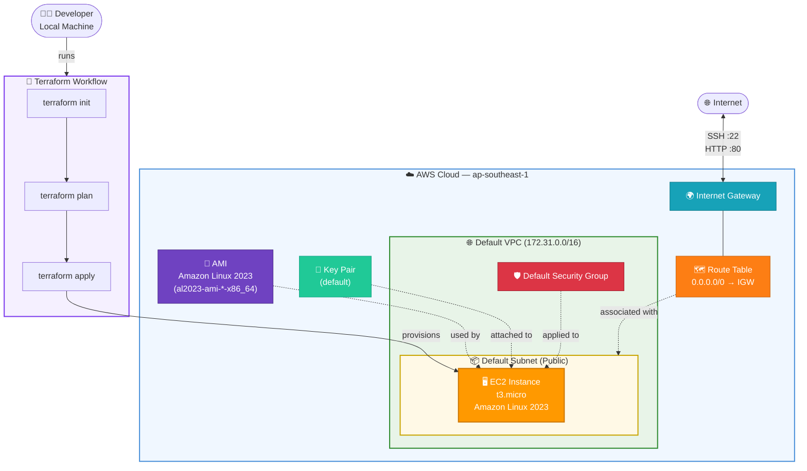
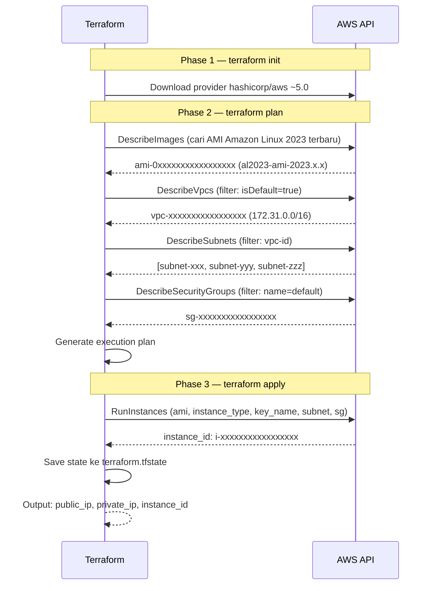
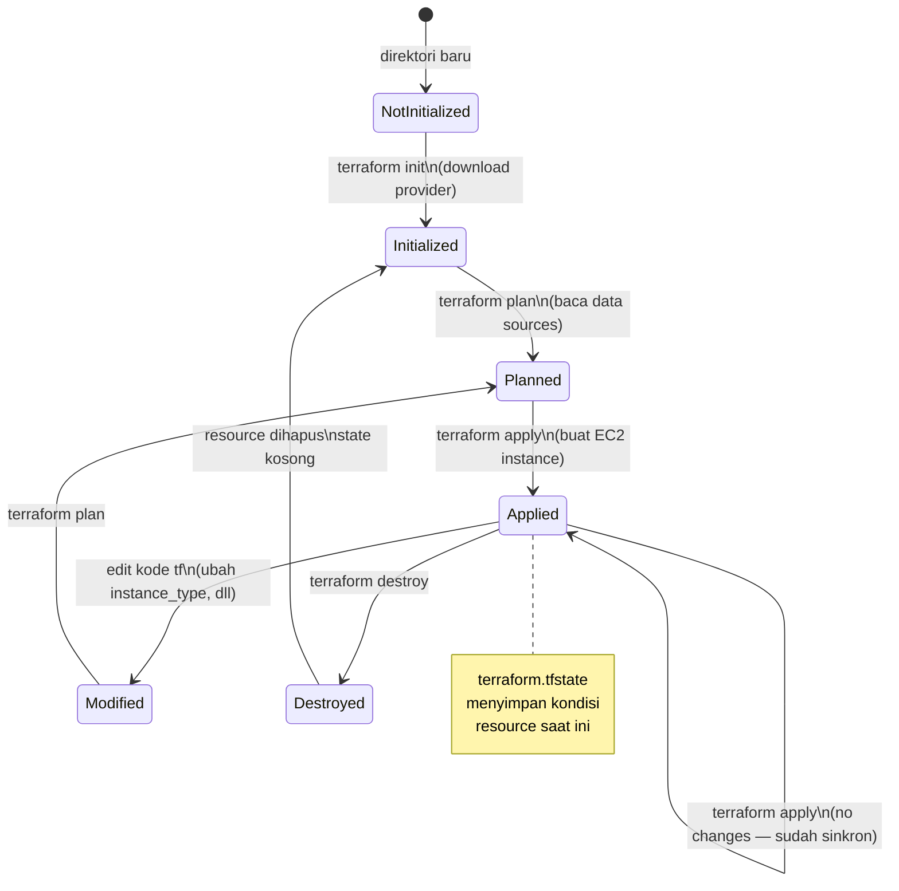

# 🚀 Panduan Deploy EC2 Instance dengan Terraform

> **Stack**: Terraform · AWS EC2 · Amazon Linux 2023  
> **Level**: Pemula hingga Menengah  
> **Estimasi waktu**: 30–45 menit

---

## 📋 Daftar Isi

1. [Prasyarat](#1-prasyarat)
2. [Struktur Direktori](#2-struktur-direktori)
3. [Arsitektur Infrastruktur](#3-arsitektur-infrastruktur)
4. [Penjelasan Kode](#4-penjelasan-kode)
5. [Langkah-Langkah Deploy](#5-langkah-langkah-deploy)
6. [Verifikasi Instance](#6-verifikasi-instance)
7. [Troubleshooting](#7-troubleshooting)
8. [Pembersihan Resource](#8-pembersihan-resource)

---

## 1. Prasyarat

Sebelum memulai, pastikan hal-hal berikut sudah terpenuhi:

### Tools yang Harus Terinstall

| Tool | Versi Minimum | Cara Cek |
|------|--------------|----------|
| Terraform | >= 1.5.0 | `terraform -version` |
| AWS CLI | >= 2.0 | `aws --version` |

### Instalasi Terraform (jika belum ada)

```bash
# macOS (Homebrew)
brew tap hashicorp/tap
brew install hashicorp/tap/terraform

# Ubuntu / Debian
sudo apt-get update && sudo apt-get install -y gnupg software-properties-common
wget -O- https://apt.releases.hashicorp.com/gpg | gpg --dearmor | sudo tee /usr/share/keyrings/hashicorp-archive-keyring.gpg
echo "deb [signed-by=/usr/share/keyrings/hashicorp-archive-keyring.gpg] https://apt.releases.hashicorp.com $(lsb_release -cs) main" | sudo tee /etc/apt/sources.list.d/hashicorp.list
sudo apt update && sudo apt install terraform

# Windows (Chocolatey)
choco install terraform
```

### Konfigurasi AWS Credentials

```bash
aws configure
```

Isi dengan informasi berikut:
```
AWS Access Key ID     : [masukkan access key ID kamu]
AWS Secret Access Key : [masukkan secret access key kamu]
Default region name   : ap-southeast-1
Default output format : json
```

> ⚠️ **Penting**: Pastikan IAM user kamu memiliki permission `AmazonEC2FullAccess` atau setidaknya policy untuk membuat, membaca, dan menghapus EC2 instance.

### Resource AWS yang Harus Sudah Ada

Kode ini menggunakan resource **default** yang sudah ada di akun AWS:

- ✅ **Default VPC** — dibuat otomatis oleh AWS saat akun baru dibuat
- ✅ **Default Security Group** — bagian dari Default VPC
- ✅ **Key Pair** — harus dibuat terlebih dahulu (lihat catatan di bawah)

#### Membuat Key Pair (jika belum ada)

```bash
# Buat key pair bernama "default" dan simpan file .pem
aws ec2 create-key-pair \
  --key-name default \
  --query 'KeyMaterial' \
  --output text > ~/.ssh/default.pem

# Set permission yang benar
chmod 400 ~/.ssh/default.pem
```

---

## 2. Struktur Direktori

```
ec2-terraform/
├── main.tf           # Resource utama (EC2, data sources)
├── variables.tf      # Deklarasi semua variabel
├── outputs.tf        # Output setelah apply
├── terraform.tfvars  # Nilai variabel (opsional, jangan di-commit!)
└── .gitignore        # Exclude file sensitif dari git
```

### Isi `.gitignore` yang Disarankan

```gitignore
# Terraform state files
*.tfstate
*.tfstate.*
.terraform/
.terraform.lock.hcl

# File variabel sensitif
terraform.tfvars
*.auto.tfvars

# Override files
override.tf
override.tf.json
*_override.tf
*_override.tf.json

# Crash log
crash.log
crash.*.log
```

---

## 3. Arsitektur Infrastruktur



### Diagram Alur Data Sources



### Diagram State Terraform



---

## 4. Penjelasan Kode

### `main.tf` — Inti Infrastruktur

#### Data Source: AMI Amazon Linux 2023

```hcl
data "aws_ami" "amazon_linux_2023" {
  most_recent = true          # Selalu ambil versi terbaru
  owners      = ["amazon"]    # Hanya dari publisher resmi Amazon

  filter {
    name   = "name"
    values = ["al2023-ami-*-x86_64"]  # Pattern nama AMI AL2023
  }
  # ...
}
```

> 💡 **Kenapa pakai `data` bukan resource?**  
> `data source` digunakan untuk **membaca** resource yang sudah ada tanpa membuatnya. AMI tidak perlu dibuat — kita hanya perlu menemukan ID-nya.

#### Resource: EC2 Instance

```hcl
resource "aws_instance" "main" {
  ami                    = data.aws_ami.amazon_linux_2023.id  # Referensi ke data source
  instance_type          = var.instance_type                   # Dari variables.tf
  key_name               = var.key_pair_name                   # Nama key pair di AWS
  subnet_id              = data.aws_subnets.default.ids[0]    # Subnet pertama dari VPC default
  vpc_security_group_ids = [data.aws_security_group.default.id]
  # ...
}
```

### `variables.tf` — Konfigurasi yang Bisa Diubah

| Variable | Default | Keterangan |
|----------|---------|------------|
| `aws_region` | `ap-southeast-1` | Region AWS (Singapore) |
| `instance_type` | `t3.micro` | Tipe instance (Free Tier eligible) |
| `key_pair_name` | `default` | Nama key pair di AWS Console |
| `instance_name` | `my-ec2-instance` | Nilai tag Name |
| `environment` | `production` | Nilai tag Environment |

### `outputs.tf` — Informasi Setelah Deploy

Setelah `terraform apply` berhasil, Terraform akan menampilkan:

```
Outputs:

ami_name    = "al2023-ami-2023.6.20240624.0-kernel-6.1-x86_64"
ami_used    = "ami-0xxxxxxxxxxxxxxxxx"
instance_id = "i-0xxxxxxxxxxxxxxxxx"
private_ip  = "172.31.xx.xx"
public_ip   = "13.xxx.xxx.xxx"
```

---

## 5. Langkah-Langkah Deploy

### Step 1 — Buat Direktori Proyek

```bash
mkdir ec2-terraform && cd ec2-terraform
```

### Step 2 — Buat Semua File Terraform

Buat ketiga file (`main.tf`, `variables.tf`, `outputs.tf`) seperti yang ada di kode sebelumnya.

### Step 3 — (Opsional) Buat `terraform.tfvars`

Untuk override nilai default tanpa mengubah `variables.tf`:

```hcl
# terraform.tfvars
aws_region    = "ap-southeast-1"
instance_type = "t3.micro"
key_pair_name = "nama-keypair-kamu"   # ← sesuaikan ini!
instance_name = "web-server"
environment   = "production"
```

### Step 4 — Inisialisasi Terraform

```bash
terraform init
```

Output yang diharapkan:
```
Initializing the backend...
Initializing provider plugins...
- Finding hashicorp/aws versions matching "~> 5.0"...
- Installing hashicorp/aws v5.x.x...

Terraform has been successfully initialized!
```

### Step 5 — Preview Perubahan

```bash
terraform plan
```

Terraform akan menampilkan semua resource yang akan dibuat. Pastikan tidak ada error sebelum lanjut.

### Step 6 — Apply (Buat Instance)

```bash
terraform apply
```

Ketik `yes` saat diminta konfirmasi:

```
Do you want to perform these actions?
  Terraform will perform the actions described above.
  Only 'yes' will be accepted to approve.

  Enter a value: yes
```

Tunggu sekitar **1–2 menit** hingga instance running.

---

## 6. Verifikasi Instance

### Cek via Output Terraform

```bash
terraform output
```

### Cek via AWS CLI

```bash
# Lihat status instance
aws ec2 describe-instances \
  --filters "Name=tag:ManagedBy,Values=Terraform" \
  --query 'Reservations[].Instances[].[InstanceId,State.Name,PublicIpAddress]' \
  --output table
```

### Koneksi SSH ke Instance

```bash
# Ambil public IP dari output
PUBLIC_IP=$(terraform output -raw public_ip)

# SSH ke instance
ssh -i ~/.ssh/default.pem ec2-user@$PUBLIC_IP
```

> 📌 **Username default** Amazon Linux 2023 adalah `ec2-user`

---

## 7. Troubleshooting

### ❌ Error: `InvalidKeyPair.NotFound`

```
Error: creating EC2 Instance: InvalidKeyPair.NotFound: 
The key pair 'default' does not exist
```

**Solusi**: Key pair belum dibuat. Jalankan:

```bash
aws ec2 create-key-pair \
  --key-name default \
  --query 'KeyMaterial' \
  --output text > ~/.ssh/default.pem && chmod 400 ~/.ssh/default.pem
```

---

### ❌ Error: `AuthFailure` atau `UnauthorizedOperation`

```
Error: UnauthorizedOperation: You are not authorized to perform this operation.
```

**Solusi**: Cek IAM permission user kamu:

```bash
aws iam get-user
aws sts get-caller-identity
```

Pastikan user memiliki policy `AmazonEC2FullAccess`.

---

### ❌ Error: `VPCIdNotSpecified` atau tidak ada Default VPC

```
Error: no matching VPC found
```

**Solusi**: Default VPC mungkin terhapus. Buat ulang:

```bash
aws ec2 create-default-vpc
```

---

### ❌ SSH Timeout / Connection Refused

**Kemungkinan penyebab dan solusi**:

1. **Instance belum sepenuhnya running** — tunggu 1–2 menit lagi
2. **Security Group tidak mengizinkan SSH** — tambahkan inbound rule port 22:
   ```bash
   # Cari ID security group default
   SG_ID=$(aws ec2 describe-security-groups \
     --filters Name=group-name,Values=default \
     --query 'SecurityGroups[0].GroupId' --output text)

   # Tambahkan rule SSH
   aws ec2 authorize-security-group-ingress \
     --group-id $SG_ID \
     --protocol tcp --port 22 --cidr 0.0.0.0/0
   ```
3. **Permission file .pem salah** — jalankan `chmod 400 ~/.ssh/default.pem`

---

## 8. Pembersihan Resource

> ⚠️ **Penting**: Jalankan ini setelah selesai agar tidak ditagih biaya EC2!

```bash
terraform destroy
```

Ketik `yes` untuk konfirmasi. Semua resource yang dibuat Terraform akan dihapus.

```
Destroy complete! Resources: 1 destroyed.
```

---

## 📚 Referensi

| Dokumen | Link |
|---------|------|
| Terraform AWS Provider Docs | https://registry.terraform.io/providers/hashicorp/aws/latest/docs |
| AWS EC2 Instance Types | https://aws.amazon.com/ec2/instance-types/ |
| Amazon Linux 2023 Docs | https://docs.aws.amazon.com/linux/al2023/ug/what-is-amazon-linux.html |
| Terraform Best Practices | https://developer.hashicorp.com/terraform/language/style |

---

*Panduan ini dibuat untuk deployment EC2 menggunakan Terraform dengan resource default AWS.*  
*Sesuaikan `instance_type` dan `aws_region` sesuai kebutuhan dan budget kamu.*
