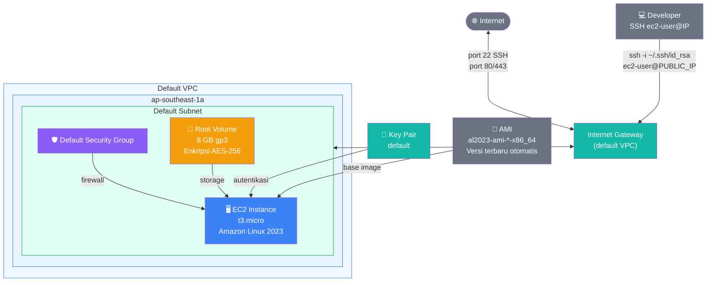
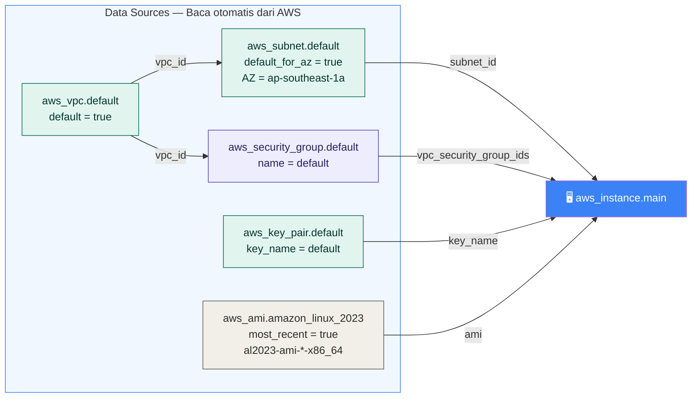

# Dokumentasi — AWS EC2 Instance dengan Terraform (Free Tier)

## Gambaran Umum

Kode ini membuat **AWS EC2 Instance** menggunakan Terraform dalam 1 file tanpa variabel. Semua resource pendukung (VPC, subnet, security group, key pair, AMI) diambil secara otomatis menggunakan **data source** tanpa perlu hardcode ID apapun.

---

## Spesifikasi Instance

| Spesifikasi | Nilai |
|-------------|-------|
| OS | Amazon Linux 2023 (versi terbaru otomatis) |
| Instance type | `t3.micro` |
| Availability Zone | `ap-southeast-1a` |
| VPC | Default VPC |
| Subnet | Default subnet di AZ 1a |
| Security Group | Default security group |
| Key Pair | `default` |
| Root volume | 30 GB gp3, terenkripsi |
| IMDSv2 | Aktif (wajib) |

---

## Status Free Tier

| Resource | Status | Keterangan |
|----------|--------|------------|
| `aws_instance` (t3.micro) | ✅ Gratis | 750 jam/bulan selama 12 bulan |
| Root volume 30 GB gp3 | ✅ Gratis | Free tier: hingga 30 GB — tepat di batas |
| Public IP (via subnet default) | ✅ Gratis | IP publik gratis jika instance berjalan |
| Data transfer masuk | ✅ Gratis | Tidak ada batas |
| Data transfer keluar | ⚠️ Perhatikan | Gratis hingga 100 GB/bulan |

---

## Diagram Arsitektur



---

## Alur Data Source



---

## Penjelasan Per Blok

### 1. Data Source — Default VPC

```hcl
data "aws_vpc" "default" {
  default = true
}
```

Membaca Default VPC yang sudah ada di akun AWS secara otomatis. Hasilnya digunakan sebagai referensi untuk mencari subnet dan security group default.

---

### 2. Data Source — Default Subnet

```hcl
data "aws_subnet" "default" {
  vpc_id            = data.aws_vpc.default.id
  availability_zone = "ap-southeast-1a"
  default_for_az    = true
}
```

Membaca default subnet di Availability Zone `ap-southeast-1a`. `default_for_az = true` memastikan hanya subnet default yang diambil, bukan subnet custom.

---

### 3. Data Source — Default Security Group

```hcl
data "aws_security_group" "default" {
  vpc_id = data.aws_vpc.default.id
  name   = "default"
}
```

Membaca security group bernama `"default"` yang otomatis tersedia di setiap VPC. Security group default mengizinkan semua trafik antar-member dalam grup yang sama, dan semua trafik keluar.

> **Catatan keamanan:** Security group default cukup untuk percobaan. Untuk production, gunakan security group khusus dengan rules yang lebih ketat.

---

### 4. Data Source — Key Pair

```hcl
data "aws_key_pair" "default" {
  key_name = "default"
}
```

Membaca key pair bernama `"default"` dari AWS. Pastikan key pair ini sudah ada di region `ap-southeast-1` sebelum menjalankan `terraform apply`. Jika belum ada, buat terlebih dahulu:

```bash
# Buat key pair bernama "default" di AWS
aws ec2 create-key-pair \
  --key-name default \
  --region ap-southeast-1 \
  --query "KeyMaterial" \
  --output text > ~/.ssh/default.pem

chmod 400 ~/.ssh/default.pem
```

---

### 5. Data Source — AMI Amazon Linux 2023

```hcl
data "aws_ami" "amazon_linux_2023" {
  most_recent = true
  owners      = ["amazon"]

  filter {
    name   = "name"
    values = ["al2023-ami-*-x86_64"]
  }

  filter {
    name   = "virtualization-type"
    values = ["hvm"]
  }
}
```

Mengambil AMI Amazon Linux 2023 **terbaru secara otomatis**. Keuntungannya dibanding hardcode AMI ID:
- Selalu menggunakan versi AMI terbaru dengan patch keamanan terkini
- Tidak perlu update kode saat AMI baru dirilis
- `owners = ["amazon"]` memastikan hanya AMI resmi dari Amazon yang digunakan

---

### 6. EC2 Instance

```hcl
resource "aws_instance" "main" {
  ami                    = data.aws_ami.amazon_linux_2023.id
  instance_type          = "t3.micro"
  subnet_id              = data.aws_subnet.default.id
  key_name               = data.aws_key_pair.default.key_name
  vpc_security_group_ids = [data.aws_security_group.default.id]

  root_block_device {
    volume_type           = "gp3"
    volume_size           = 8
    delete_on_termination = true
    encrypted             = true
  }

  metadata_options {
    http_tokens = "required"
  }
}
```

| Atribut | Nilai | Keterangan |
|---------|-------|------------|
| `ami` | dari data source | AMI Amazon Linux 2023 terbaru |
| `instance_type` | `t3.micro` | 2 vCPU, 1 GB RAM, free tier eligible |
| `subnet_id` | default subnet 1a | Subnet publik dengan auto-assign IP |
| `key_name` | `default` | Key pair untuk SSH |
| `vpc_security_group_ids` | default SG | Firewall virtual |
| `volume_type` | `gp3` | SSD generasi terbaru, lebih cepat dari gp2 |
| `volume_size` | `30` GB | Minimum snapshot AMI AL2023 & tepat di batas free tier |
| `encrypted` | `true` | Enkripsi disk tanpa biaya tambahan |
| `http_tokens` | `required` | Wajib IMDSv2 — lebih aman |

---

## Cara Penggunaan

### Langkah 1 — Pastikan key pair `default` sudah ada

```bash
# Cek apakah key pair sudah ada
aws ec2 describe-key-pairs \
  --key-names default \
  --region ap-southeast-1

# Jika belum ada, buat dengan perintah ini
aws ec2 create-key-pair \
  --key-name default \
  --region ap-southeast-1 \
  --query "KeyMaterial" \
  --output text > ~/.ssh/default.pem

chmod 400 ~/.ssh/default.pem
```

### Langkah 2 — Jalankan Terraform

```bash
terraform init
terraform plan
terraform apply
# Ketik "yes" saat diminta konfirmasi
```

### Langkah 3 — Lihat Output

```
Outputs:

instance_ami       = "ami-0abcdef1234567890"
instance_ami_name  = "al2023-ami-2023.5.20250101.0-kernel-6.1-x86_64"
instance_id        = "i-0abc123def456789"
instance_private_ip = "172.31.10.20"
instance_public_ip = "54.xx.xx.xx"
ssh_command        = "ssh -i ~/.ssh/id_rsa ec2-user@54.xx.xx.xx"
```

### Langkah 4 — SSH ke Instance

```bash
# Gunakan perintah dari output ssh_command
ssh -i ~/.ssh/id_rsa ec2-user@54.xx.xx.xx

# Atau jika menggunakan key pair default.pem
ssh -i ~/.ssh/default.pem ec2-user@54.xx.xx.xx
```

> User default untuk Amazon Linux 2023 adalah `ec2-user`.

### Langkah 5 — Verifikasi Instance

```bash
# Di dalam EC2 (setelah SSH)

# Cek versi OS
cat /etc/os-release

# Cek resource
free -h      # memory
df -h        # disk
nproc        # jumlah CPU

# Update package (opsional)
sudo dnf update -y
```

---

## Output Lengkap

| Output | Keterangan | Contoh nilai |
|--------|------------|--------------|
| `instance_id` | ID instance EC2 | `i-0abc123def456789` |
| `instance_public_ip` | IP publik untuk SSH dan akses | `54.xx.xx.xx` |
| `instance_private_ip` | IP privat dalam VPC | `172.31.10.20` |
| `instance_ami` | AMI ID yang digunakan | `ami-0abc...` |
| `instance_ami_name` | Nama lengkap AMI | `al2023-ami-2023.5...` |
| `ssh_command` | Perintah SSH siap pakai | `ssh -i ~/.ssh/id_rsa ec2-user@54.xx.xx.xx` |

---

## Catatan Penting

### Hentikan instance saat tidak digunakan

Free tier EC2 memberikan **750 jam/bulan**. Jika instance berjalan 24 jam sehari selama 31 hari = 744 jam — masih dalam batas. Namun jika menjalankan lebih dari 1 instance secara bersamaan, jam akan terhitung secara paralel.

```bash
# Stop instance saat tidak digunakan (hemat jam free tier)
aws ec2 stop-instances \
  --instance-ids i-0abc123def456789 \
  --region ap-southeast-1

# Start kembali saat dibutuhkan
aws ec2 start-instances \
  --instance-ids i-0abc123def456789 \
  --region ap-southeast-1
```

> **Perhatian:** IP publik akan berubah setiap kali instance di-start ulang karena menggunakan dynamic IP. Untuk IP tetap, gunakan Elastic IP (tapi perhatikan biayanya jika tidak digunakan).

### Hapus instance setelah selesai

```bash
terraform destroy
# Ketik "yes" saat diminta konfirmasi
```

---

## Referensi Terraform Registry

- [aws_instance](https://registry.terraform.io/providers/hashicorp/aws/latest/docs/resources/instance)
- [aws_ami (data source)](https://registry.terraform.io/providers/hashicorp/aws/latest/docs/data-sources/ami)
- [aws_vpc (data source)](https://registry.terraform.io/providers/hashicorp/aws/latest/docs/data-sources/vpc)
- [aws_subnet (data source)](https://registry.terraform.io/providers/hashicorp/aws/latest/docs/data-sources/subnet)
- [aws_security_group (data source)](https://registry.terraform.io/providers/hashicorp/aws/latest/docs/data-sources/security_group)
- [aws_key_pair (data source)](https://registry.terraform.io/providers/hashicorp/aws/latest/docs/data-sources/key_pair)