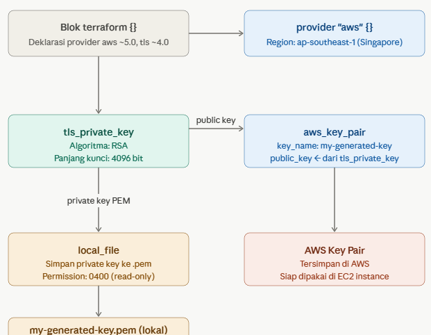

## Penjelasan Per Blok

** 1. Blok `terraform {}` — Konfigurasi Awal **
    
    terraform {
        required_providers {
            aws = { source = "hashicorp/aws", version = "~> 5.0" }
            tls = { source = "hashicorp/tls", version = "~> 4.0" }
        }
    }
    

