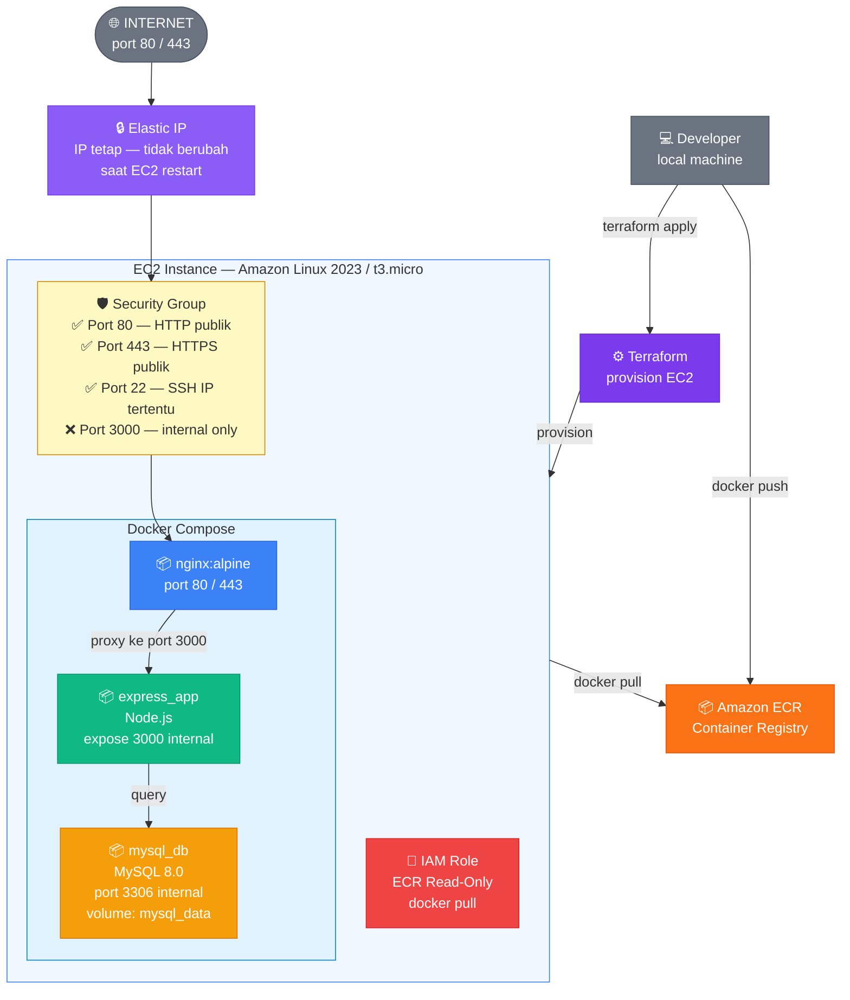
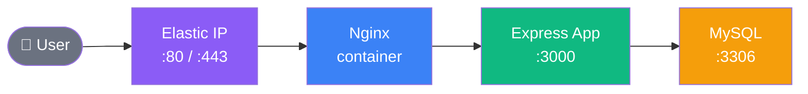
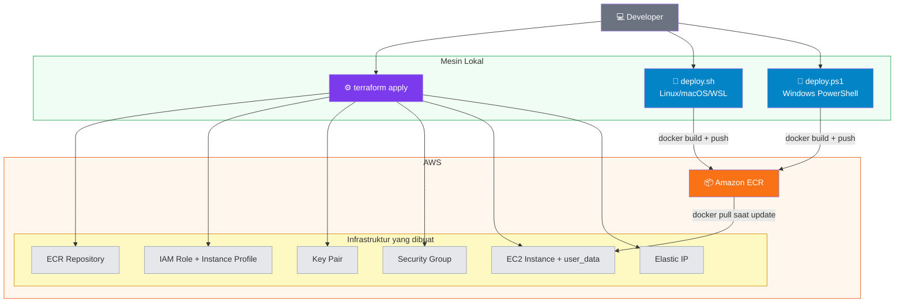
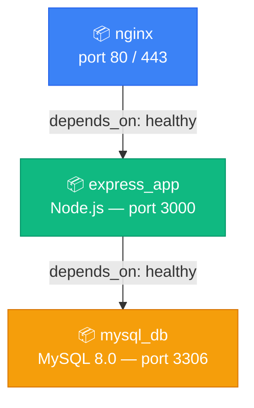

# Panduan Deploy Node.js ke AWS EC2 dengan Docker & Terraform

## Daftar Isi

- [Kompatibilitas Sistem Operasi](#kompatibilitas-sistem-operasi)
- [Arsitektur](#arsitektur)
- [Struktur File](#struktur-file)
- [Prasyarat](#prasyarat)
- [Langkah 1 — Persiapan Lokal](#langkah-1--persiapan-lokal)
- [Langkah 2 — Sesuaikan Dockerfile](#langkah-2--sesuaikan-dockerfile)
- [Langkah 3 — Konfigurasi Terraform](#langkah-3--konfigurasi-terraform)
- [Langkah 4 — Provision Infrastruktur](#langkah-4--provision-infrastruktur)
- [Langkah 5 — Build & Push Image ke ECR](#langkah-5--build--push-image-ke-ecr)
- [Langkah 6 — Verifikasi Deploy](#langkah-6--verifikasi-deploy)
- [Langkah 7 — Update Aplikasi](#langkah-7--update-aplikasi)
- [Referensi Konfigurasi](#referensi-konfigurasi)

---

## Kompatibilitas Sistem Operasi

Panduan ini kompatibel dengan **Windows 10, Windows 11, macOS, dan Linux**.

Untuk pengguna Windows, setiap langkah yang memerlukan penyesuaian akan ditandai dengan label berikut:

> 🪟 **Windows** — catatan atau perintah khusus Windows

> 🐧 **Linux / macOS** — perintah standar

Secara umum ada dua pendekatan untuk Windows:


| Pendekatan              | Kelebihan                           | Cocok untuk                                     |
| ----------------------- | ----------------------------------- | ----------------------------------------------- |
| **PowerShell / CMD**    | Tidak perlu install tambahan        | Pengguna yang tidak familiar Linux              |
| **WSL 2 (rekomendasi)** | Semua perintah Linux langsung jalan | Pengguna yang sering kerja dengan tools backend |


### Rekomendasi: Gunakan WSL 2

WSL 2 (Windows Subsystem for Linux) memungkinkan kamu menjalankan semua perintah di panduan ini tanpa modifikasi apapun. Ini adalah cara paling mulus untuk bekerja dengan Docker, Terraform, dan AWS CLI di Windows.

> 🪟 **Windows** — Install WSL 2 (lakukan sekali saja):
>
> ```powershell
> # Jalankan PowerShell sebagai Administrator
> wsl --install
> # Restart PC setelah selesai, lalu buka "Ubuntu" dari Start Menu
> ```
>
> Setelah WSL aktif, semua perintah di panduan ini bisa dijalankan langsung di terminal Ubuntu.

---

## Arsitektur

### Infrastruktur EC2



### Alur Traffic Request



### Alur Deployment



---

## Struktur File

```
project-root/
├── Dockerfile                    # Multi-stage build Node.js 22
├── .dockerignore
├── docker-compose.yml            # Nginx + Express + MySQL
├── deploy.sh                     # Script build & push ke ECR (Linux/macOS/WSL)
├── deploy.ps1                    # Script build & push ke ECR (Windows PowerShell)
├── nginx/
│   ├── nginx.conf                # Konfigurasi reverse proxy
│   └── ssl/                      # Letakkan sertifikat SSL di sini
└── terraform/
    ├── main.tf                   # Resource AWS utama
    ├── variables.tf              # Definisi semua variabel
    ├── terraform.tfvars          # Nilai variabel (JANGAN di-commit!)
    ├── terraform.tfvars.example  # Template tfvars
    └── user_data.sh.tpl          # Script setup EC2 saat pertama boot
```

---

## Prasyarat

### Tools yang perlu diinstall


| Tool           | Versi minimum | Download                                                                                  |
| -------------- | ------------- | ----------------------------------------------------------------------------------------- |
| Terraform      | >= 1.5        | [Download](https://developer.hashicorp.com/terraform/install)                             |
| AWS CLI        | >= 2.x        | [Download](https://docs.aws.amazon.com/cli/latest/userguide/getting-started-install.html) |
| Docker Desktop | >= 24.x       | [Download](https://docs.docker.com/get-docker/)                                           |


Verifikasi instalasi:

```bash
terraform -version
aws --version
docker --version
```

> 🪟 **Windows** — Jalankan perintah di atas di **PowerShell** atau **CMD**. Semua tools di atas tersedia dalam versi installer Windows (`.exe` / `.msi`) dan bisa dijalankan langsung tanpa WSL.
>
> Untuk Docker Desktop di Windows, pastikan fitur **"Use WSL 2 based engine"** diaktifkan di **Settings → General**.

### Akun AWS yang dibutuhkan

- IAM user dengan permission: `EC2`, `ECR`, `IAM`
- Access Key & Secret Key sudah tersedia

---

## Langkah 1 — Persiapan Lokal

### 1.1 Konfigurasi AWS CLI

> 🐧 **Linux / macOS / WSL:**
>
> ```bash
> aws configure
> # AWS Access Key ID: isi access key kamu
> # AWS Secret Access Key: isi secret key kamu
> # Default region name: ap-southeast-1
> # Default output format: json
> ```

> 🪟 **Windows (PowerShell / CMD):**
>
> ```powershell
> aws configure
> # Sama persis — AWS CLI Windows menggunakan perintah yang sama
> ```

Verifikasi (semua OS):

```bash
aws sts get-caller-identity
```

### 1.2 Generate SSH Key Pair

> Lewati langkah ini jika sudah punya file `id_rsa.pub` di folder `.ssh`.

> 🐧 **Linux / macOS / WSL:**
>
> ```bash
> ssh-keygen -t rsa -b 4096 -f ~/.ssh/id_rsa
> # Tekan Enter dua kali untuk tanpa passphrase
> ```

> 🪟 **Windows (PowerShell)** — `ssh-keygen` sudah tersedia bawaan Windows 10/11:
>
> ```powershell
> ssh-keygen -t rsa -b 4096 -f "$env:USERPROFILE\.ssh\id_rsa"
> # Tekan Enter dua kali untuk tanpa passphrase
> ```
>
> File public key akan tersimpan di: `C:\Users\NamaKamu\.ssh\id_rsa.pub`

### 1.3 Cek IP Publik Lokal

IP ini digunakan untuk membatasi akses SSH ke EC2 hanya dari mesin kamu.

> 🐧 **Linux / macOS / WSL:**
>
> ```bash
> curl ifconfig.me
> # Contoh output: 103.10.20.30
> ```

> 🪟 **Windows (PowerShell):**
>
> ```powershell
> (Invoke-WebRequest -Uri "https://ifconfig.me/ip" -UseBasicParsing).Content.Trim()
> # Contoh output: 103.10.20.30
> ```
>
> Atau buka `https://ifconfig.me` langsung di browser.

---

## Langkah 2 — Sesuaikan Dockerfile

Buka `Dockerfile` dan sesuaikan baris berikut dengan entry point aplikasi kamu:

```dockerfile
# Sesuaikan dengan entry point aplikasi kamu
CMD ["node", "src/index.js"]
```

Jika menggunakan **TypeScript**, uncomment bagian build step:

```dockerfile
# Stage 2: Builder
RUN npm run build

# Stage 3: Runner — ganti dari source ke hasil build
COPY --from=builder --chown=nodeuser:nodejs /app/dist ./dist
CMD ["node", "dist/index.js"]
```

Pastikan aplikasi memiliki endpoint `/health` yang mengembalikan HTTP 200, karena digunakan oleh Docker health check dan Nginx:

```javascript
app.get('/health', (req, res) => res.json({ status: 'ok' }));
```

> 🪟 **Windows** — Tidak ada penyesuaian khusus untuk langkah ini. Edit file menggunakan editor apapun (VS Code, Notepad++, dll).

---

## Langkah 3 — Konfigurasi Terraform

### 3.1 Salin file konfigurasi

> 🐧 **Linux / macOS / WSL:**
>
> ```bash
> cd terraform
> cp terraform.tfvars.example terraform.tfvars
> ```

> 🪟 **Windows (PowerShell):**
>
> ```powershell
> cd terraform
> Copy-Item terraform.tfvars.example terraform.tfvars
> ```

### 3.2 Isi `terraform.tfvars`

Buka `terraform.tfvars` dengan editor teks dan isi nilai berikut:

```hcl
aws_region        = "ap-southeast-1"   # Region AWS
app_name          = "myapp"             # Nama prefix semua resource
environment       = "production"

ec2_instance_type = "t3.micro"          # Free tier eligible

# Key Pair — Terraform akan upload public key ini ke AWS
key_pair_name       = "myapp-keypair"
ssh_public_key_path = "~/.ssh/id_rsa.pub"

# Ganti dengan IP dari langkah 1.3
ssh_allowed_cidr  = "103.10.20.30/32"

# Database
db_name           = "myapp_db"
db_user           = "myapp_user"
db_password       = "password-yang-kuat"
db_root_password  = "root-password-yang-kuat"
```

> 🪟 **Windows** — Untuk `ssh_public_key_path`, gunakan salah satu format berikut (keduanya valid di Terraform):
>
> ```hcl
> # Format dengan tilde (direkomendasikan — lebih portable)
> ssh_public_key_path = "~/.ssh/id_rsa.pub"
>
> # Format path Windows penuh (jika tilde tidak bekerja)
> ssh_public_key_path = "C:/Users/NamaKamu/.ssh/id_rsa.pub"
> ```
>
> Gunakan **forward slash** (`/`), bukan backslash (`\`), meskipun di Windows.

### 3.3 Tambahkan `terraform.tfvars` ke `.gitignore`

> **Penting:** File ini berisi credential sensitif — jangan di-commit ke git.

> 🐧 **Linux / macOS / WSL:**
>
> ```bash
> echo "terraform/terraform.tfvars" >> .gitignore
> ```

> 🪟 **Windows (PowerShell):**
>
> ```powershell
> Add-Content .gitignore "`nterraform/terraform.tfvars"
> ```
>
> Atau tambahkan baris `terraform/terraform.tfvars` secara manual ke file `.gitignore` menggunakan editor teks.

### 3.4 Resource yang akan dibuat Terraform


| Resource                   | Keterangan                                      |
| -------------------------- | ----------------------------------------------- |
| `aws_ecr_repository`       | Container registry untuk menyimpan Docker image |
| `aws_ecr_lifecycle_policy` | Hapus otomatis image lama, simpan 10 terbaru    |
| `aws_iam_role`             | Role EC2 agar bisa pull dari ECR                |
| `aws_iam_instance_profile` | Attach IAM role ke EC2                          |
| `aws_key_pair`             | Upload SSH public key ke AWS                    |
| `aws_security_group`       | Firewall EC2 (port 80, 443, 22)                 |
| `aws_instance`             | EC2 instance dengan Docker & app berjalan       |
| `aws_eip`                  | Elastic IP (IP statis untuk EC2)                |


---

## Langkah 4 — Provision Infrastruktur

Perintah Terraform sama di semua OS — jalankan di terminal apapun (PowerShell, CMD, Git Bash, atau WSL):

```bash
cd terraform

# Download provider AWS
terraform init

# Preview resource yang akan dibuat (tidak ada perubahan nyata)
terraform plan

# Buat semua resource di AWS
terraform apply
# Ketik "yes" saat diminta konfirmasi
```

Setelah selesai, Terraform akan menampilkan output:

```
Outputs:

ec2_public_ip      = "54.xx.xx.xx"
ecr_repository_url = "123456789.dkr.ecr.ap-southeast-1.amazonaws.com/myapp-production"
key_pair_name      = "myapp-keypair"
ssh_command        = "ssh -i ~/.ssh/id_rsa ec2-user@54.xx.xx.xx"
```

> **Catatan:** EC2 membutuhkan waktu sekitar 3–5 menit untuk selesai setup (install Docker, pull image, dll) setelah `terraform apply` selesai.

---

## Langkah 5 — Build & Push Image ke ECR

### 5.1 Sesuaikan script deploy

Buka file deploy dan ubah variabel konfigurasi di bagian atas:

> 🐧 **Linux / macOS / WSL** — edit `deploy.sh`:
>
> ```bash
> AWS_REGION="ap-southeast-1"
> ECR_REPO_NAME="myapp-production"   # harus sama dengan: {app_name}-{environment}
> ```

> 🪟 **Windows (PowerShell)** — edit `deploy.ps1`:
>
> ```powershell
> $AWS_REGION    = "ap-southeast-1"
> $ECR_REPO_NAME = "myapp-production"   # harus sama dengan: {app_name}-{environment}
> ```

### 5.2 Jalankan deploy

> 🐧 **Linux / macOS / WSL:**
>
> ```bash
> # Berikan permission execute (sekali saja)
> chmod +x deploy.sh
>
> # Push dengan tag versi
> ./deploy.sh v1.0.0
>
> # Atau push sebagai latest saja
> ./deploy.sh
> ```

> 🪟 **Windows (PowerShell):**
>
> ```powershell
> # Push dengan tag versi
> .\deploy.ps1 -Tag v1.0.0
>
> # Atau push sebagai latest saja
> .\deploy.ps1
> ```
>
> Jika muncul error `"running scripts is disabled on this system"`, jalankan perintah berikut di PowerShell sebagai Administrator:
>
> ```powershell
> Set-ExecutionPolicy -ExecutionPolicy RemoteSigned -Scope CurrentUser
> ```

Script ini akan:

1. Login ke ECR menggunakan kredensial AWS CLI
2. Build Docker image untuk platform `linux/amd64`
3. Push image ke ECR dengan tag yang ditentukan dan tag `latest`

---

## Langkah 6 — Verifikasi Deploy

### 6.1 SSH ke EC2 dan cek status container

> 🐧 **Linux / macOS / WSL:**
>
> ```bash
> ssh -i ~/.ssh/id_rsa ec2-user@54.xx.xx.xx
> ```

> 🪟 **Windows (PowerShell)** — SSH sudah built-in di Windows 10/11:
>
> ```powershell
> ssh -i "$env:USERPROFILE\.ssh\id_rsa" ec2-user@54.xx.xx.xx
> ```

Setelah masuk ke EC2, jalankan perintah berikut (sama di semua OS karena sudah di dalam Linux):

```bash
# Cek semua container berjalan
docker compose ps

# Contoh output yang diharapkan:
# NAME           STATUS
# nginx          Up (healthy)
# express_app    Up (healthy)
# mysql_db       Up (healthy)
```

### 6.2 Cek log aplikasi

```bash
# Log semua service sekaligus
docker compose logs -f

# Log per service
docker compose logs -f app
docker compose logs -f nginx
docker compose logs -f mysql
```

### 6.3 Test endpoint dari luar

> 🐧 **Linux / macOS / WSL:**
>
> ```bash
> curl http://54.xx.xx.xx/health
> # Expected: {"status":"ok"}
> ```

> 🪟 **Windows (PowerShell):**
>
> ```powershell
> Invoke-WebRequest -Uri "http://54.xx.xx.xx/health" -UseBasicParsing
> # Expected: StatusCode 200, Content: {"status":"ok"}
> ```
>
> Atau buka `http://54.xx.xx.xx/health` langsung di browser.

### 6.4 Cek log Nginx

```bash
# Di dalam EC2 (setelah SSH)
docker compose exec nginx cat /var/log/nginx/access.log
docker compose exec nginx cat /var/log/nginx/error.log
```

---

## Langkah 7 — Update Aplikasi

Setiap kali ada perubahan kode, ulangi langkah berikut:

**Dari mesin lokal — build & push image baru:**

> 🐧 **Linux / macOS / WSL:**
>
> ```bash
> ./deploy.sh v1.0.1
> ```

> 🪟 **Windows (PowerShell):**
>
> ```powershell
> .\deploy.ps1 -Tag v1.0.1
> ```

**SSH ke EC2:**

> 🐧 **Linux / macOS / WSL:**
>
> ```bash
> ssh -i ~/.ssh/id_rsa ec2-user@54.xx.xx.xx
> ```

> 🪟 **Windows (PowerShell):**
>
> ```powershell
> ssh -i "$env:USERPROFILE\.ssh\id_rsa" ec2-user@54.xx.xx.xx
> ```

**Di dalam EC2 — pull & restart (sama di semua OS):**

```bash
cd ~/app

# Login ECR & pull image terbaru
aws ecr get-login-password --region ap-southeast-1 | \
  docker login --username AWS --password-stdin \
  123456789.dkr.ecr.ap-southeast-1.amazonaws.com

docker compose pull
docker compose up -d

# Verifikasi
docker compose ps
```

---

## Referensi Konfigurasi

### Security Group — Port yang dibuka


| Port | Protokol | Source       | Keterangan                          |
| ---- | -------- | ------------ | ----------------------------------- |
| 80   | TCP      | 0.0.0.0/0    | HTTP — diterima Nginx               |
| 443  | TCP      | 0.0.0.0/0    | HTTPS — aktifkan setelah pasang SSL |
| 22   | TCP      | IP kamu/32   | SSH — hanya dari IP yang diizinkan  |
| 3000 | —        | Tidak dibuka | Internal Docker network saja        |
| 3306 | —        | Tidak dibuka | Internal Docker network saja        |


### Docker Compose — Service dan dependency



### Nginx — Konfigurasi reverse proxy

Nginx menerima semua request publik di port 80 dan meneruskannya ke container `app` di port 3000 melalui Docker internal network. Port 3000 tidak pernah terekspos ke host atau internet.

Untuk mengaktifkan HTTPS, letakkan file sertifikat di `nginx/ssl/` dan uncomment blok `server { listen 443 ... }` di `nginx/nginx.conf`.

### Terraform — Variabel lengkap


| Variabel              | Default             | Keterangan                 |
| --------------------- | ------------------- | -------------------------- |
| `aws_region`          | `ap-southeast-1`    | Region AWS (Singapore)     |
| `app_name`            | `myapp`             | Prefix semua resource      |
| `environment`         | `production`        | Label environment          |
| `ec2_instance_type`   | `t3.micro`          | Tipe instance EC2          |
| `ec2_ami_id`          | Amazon Linux 2023   | AMI untuk EC2              |
| `key_pair_name`       | `myapp-keypair`     | Nama Key Pair di AWS       |
| `ssh_public_key_path` | `~/.ssh/id_rsa.pub` | Path public key lokal      |
| `ssh_allowed_cidr`    | `0.0.0.0/0`         | **Wajib diisi** IP kamu/32 |
| `db_name`             | —                   | Nama database              |
| `db_user`             | —                   | Username MySQL             |
| `db_password`         | —                   | Password MySQL             |
| `db_root_password`    | —                   | Root password MySQL        |


### Perintah berguna saat di EC2

Semua perintah berikut dijalankan di dalam EC2 (setelah SSH), sehingga sama di semua OS:

```bash
# Restart semua service
docker compose restart

# Restart satu service saja
docker compose restart app

# Stop semua
docker compose down

# Lihat penggunaan resource (CPU, RAM, network)
docker stats

# Masuk ke shell container
docker compose exec app sh
docker compose exec mysql mysql -u root -p

# Hapus image lama yang tidak terpakai
docker image prune -f
```

### Ringkasan perbedaan perintah Windows vs Linux/macOS


| Operasi          | Linux / macOS / WSL                          | Windows (PowerShell)                                                                |
| ---------------- | -------------------------------------------- | ----------------------------------------------------------------------------------- |
| Cek IP publik    | `curl ifconfig.me`                           | `(Invoke-WebRequest -Uri "https://ifconfig.me/ip" -UseBasicParsing).Content.Trim()` |
| Generate SSH key | `ssh-keygen -t rsa -b 4096 -f ~/.ssh/id_rsa` | `ssh-keygen -t rsa -b 4096 -f "$env:USERPROFILE\.ssh\id_rsa"`                       |
| Path SSH key     | `~/.ssh/id_rsa`                              | `$env:USERPROFILE\.ssh\id_rsa`                                                      |
| SSH ke EC2       | `ssh -i ~/.ssh/id_rsa ec2-user@IP`           | `ssh -i "$env:USERPROFILE\.ssh\id_rsa" ec2-user@IP`                                 |
| Salin file       | `cp file.example file`                       | `Copy-Item file.example file`                                                       |
| Tambah ke file   | `echo "teks" >> file`                        | `Add-Content file "teks"`                                                           |
| Jalankan deploy  | `./deploy.sh v1.0.0`                         | `.\deploy.ps1 -Tag v1.0.0`                                                          |
| Test HTTP        | `curl http://IP/health`                      | `Invoke-WebRequest -Uri "http://IP/health"`                                         |